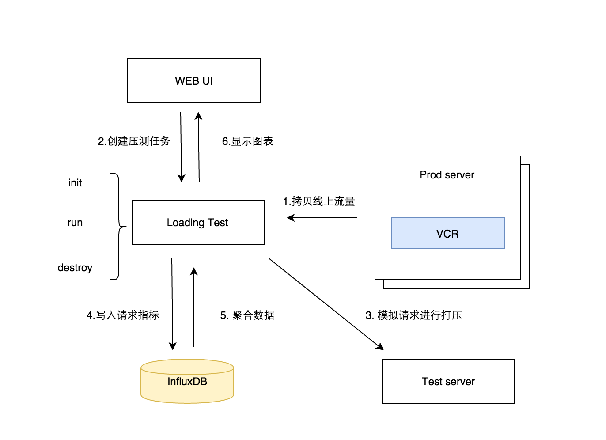
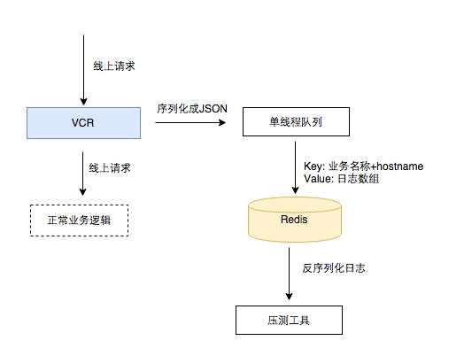

## 压测

### [微博如今能应对多少明星同时出轨？](https://mp.weixin.qq.com/s?__biz=MzIzMzk2NDQyMw==&mid=2247486632&amp;idx=1&amp;sn=c9b9dbe970cd18fb3491746f73c8737c)

### [系统稳定性保障核武器——全链路压测](https://yq.aliyun.com/articles/163747)

### [滴滴全链路压测解决之道](https://mp.weixin.qq.com/s/T0bDCiw2zX-TmqVq6HoTAw)

### [从0到1构建美团压测工具](https://tech.meituan.com/loading_test.html)
#### 疑问
1. VCR为什么不直接用tcpdump，这样不需要JSON序列化和反序列化，但是需要对dump的数据进行tcp解包，处理分包和粘包的情况，需要适配各种tcp层面的协议。
2. 如果请求对象中有二进制，JSON需要做base64编码，如果请求对象嵌套层级很深，JSON性能可能也不行。

#### WHY
1. 通过脚本解析日志还原请求，复杂请求难以实现，日志、请求格式难以同步
2. 搭建压测工具环境成本
3. 压测指标统计方式不一致

#### DRY
1. [JMeter](http://jmeter.apache.org/)：针对HTTP服务，美团内部的RPC服务大多构建在Thrift之上
2. [iago](https://github.com/twitter/iago)：支持thrift，但是文档少、依赖scala，工具不容易构建

#### MILESTONE
1. 线上流量拷贝
2. 简单易用的操作界面（接入压测的时间应该控制在1小时以内）
3. 清晰的图表能反映压测应用的各项指标
4. 满足包括Thrift、HTTP等服务的压测需求

>压测工具上线以来，已经接入了20多个应用，完成数百次打压实验，现在应用的接入时间仅需要15～30分钟。保证了美团服务的稳定和节省了开发同学的时间，使大家告别了以往繁琐冗长的打压测试。

#### HOW


##### VCR
以Maven Package的方式提供给用户，选取生产环境的单台机器（减小对线上服务影响1）对服务代码埋点，将内存中的请求对象序列化为JSON，单线程异步写入redis（减小对线上服务影响2），压测工具发压时从redis读取JSON，反序列化即可得到内存中的请求对象。


```Java
public class TestAppRPC implements TestApp.Iface {

    private Vcr _vcr = new Vcr("testapp"); // 指定拷贝流量的key

    @Override
    public TestResponse echo(TestRequest req) throws TException {
        _vcr.copy(req); // 拷贝操作
        long start = System.currentTimeMillis();
        TestResponse response = new TestResponse();
        return response;
    }
}
```

##### InfluxDB
压测指标计算，压测指标存储服务支持数据聚合
```
SELECT PERCENTILE(response_time, 90) FROM test_series GROUP BY time(10s)
```

##### Web UI
1. 查看dump的数据包
2. 配置化方式创建压测任务，不同的应用需要实现Runner接口，模拟请求进行发压
3. 查看压测结果：图、表

```Java
interface Runner {
    def init(Test app)
    def run(Test app, String log)
    def destroy(Test app)
}

class TestServiceRunner implements Runner {

    RPCService.Client _client
    TTransport _transport;

    @Override
    def init(Test app) {
        def conf = app.config // 读取应用配置
        _transport = new TFramedTransport(new TSocket(conf.get("thrift_service_host") as String, conf.get("thrift_service_port") as int))
        TProtocol protocol = new TBinaryProtocol(_transport)
        _client = new RPCService.Client(protocol)
        _transport.open()
    }

    @Override
    def run(Test app, String log) {
        TestRequest req = Vcr.deSerialize(log, TestRequest.class) // 将拷贝流量反序列化
        _client.echo(req) // 发送请求
    }

    @Override
    def destroy(Test app) {
        _transport.close() // 关闭服务
    }
}
```
