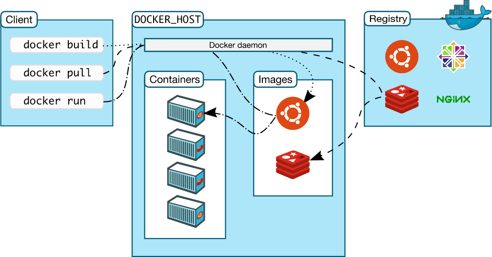

## [Docker vs. Kubernetes vs. Apache Mesos: Why What You Think You Know is Probably Wrong](https://mesosphere.com/blog/docker-vs-kubernetes-vs-apache-mesos/)

### TLDR

### 翻译

无数的文章、社交媒体在探讨Docker、Kubernetes、Mesos三者之间孰优孰劣。如果你听信了某些一知半解者的言论，你可能会认为这三个开源项目正在为争夺容器霸权而殊死战斗。同时，你也会相信，在这三者间的选择无异于对其所奉宗教的信仰，而且真正k的信徒敢于大胆和异教徒作斗争，并且拥护自己的信仰。

那些都是扯淡。

虽然这三种技术都可以使用容器来部署、管理和扩展应用程序，但实际上它们每个都侧重解决不同的问题，并且扎根非常不同的环境之上。事实上，这三种被广泛采用的工具链彼此完全不同。

与其比较这些快速演进的技术的重叠特性，不如让我们回顾一下每个项目的原始任务、架构以及它们之间如何相互补充和交互。

让我们从Docker开始
今天的Docker公司脱胎于一个平台即服务的初创公司dotCloud。dotCloud团队发现，在许多应用程序和客户之间管理依赖关系和二进制文件需要做大量的工作。因此，他们将Linux cgroups和namespaces的一些功能组合成一个简单易用的包，这样应用程序就可以在任何基础设施上持续运行。这个包就是Docker镜像，它提供以下功能:

将应用程序和库封装在单个包中(Docker镜像)，因此应用程序可以跨多环境一致部署;
提供类似于git的语义，例如“dockerpush”，“docker commit”，这样可以让应用程序开发人员可以轻松地采用新技术，并将其融入到现有的workflow中;
将Docker镜像定义为不可变层，启用不可变的基础设施。提交的更改被存储为一个单独的只读层，这让镜像复用和跟踪更改变得更加容易。另外，层还可以通过传输更新而不是整个镜像来节省磁盘空间和网络流量;
通过使用可以临时存储运行时更改的可写层来实例化不可变映像，从而方便快速部署和扩展应用程序的多个实例。
随着Docker的风靡，开发人员开始从笔记本电脑转移到在生产环境中运行。这就需要借助工具来协调这些容器，我们称为容器编排。有趣的是，Apache Mesos的Marathon成为当时(2014年6月)第一个支持Docker镜像的容器编排工具(我们将在下面详细描述它)。就连Docker创始人、首席技术官Solomon Hykes也推荐Mesos为“生产集群的黄金标准”。不久之后，除了Marathon之外，许多容器编排技术出现了，这其中包括：Nomad、Kubernetes、DockerSwarm(现在是Docker引擎的一部分)。

随着Docker开始商业化开源文件格式，该公司也开始引入工具来补充核心Docker文件格式和runtime引擎，包括:

Dockerhub
Docker registry
Docker cloud
Dockerdatacenter
图0：[外文翻译]你也许理解错了：Docker、Kubernetes和Apache Mesos之间的正确关系
​Docker让开发者可以打包他们的应用以及依赖包到一个可移植的容器中的特性，使其成为软件行业的游戏规则改变者;这有点类似mp3格式帮助重塑了音乐产业。Docker文件格式成为行业标准，并且领导容器技术供应商(包括Docker、Pivotal, Mesosphere以及其他许多)成立CNCF和OCI。今天，CNCF和OCI的目标就是确保跨容器技术的互操作性和标准化接口，并确保使用任何工具构建的Docker容器，都可以在任何runtime或基础设施上运行。

Kubernetes
谷歌很早就认识到Docker镜像的潜力，并试图在谷歌云平台上交付“容器编排即服务”。谷歌在容器方面有丰富的经验(他们在Linux中引入了cgroups)，但是现有的内部容器和像Borg这样的分布式计算工具与它们的基础设施直接耦合。因此，谷歌没有使用现有系统中的任何代码，而是从头开始设计了Kubernetes，以编排Docker容器。Kubernetes于2015年2月发布，并提出以下目标和考虑:

为应用程序开发人员提供一个强大的工具，用于Docker容器编排，而不必与底层基础设施交互;
跨云环境下，为一致的应用程序部署经验和APIs 提供标准部署接口和原型;
构建一个模块化的API核心，允许供应商围绕核心Kubernetes技术集成系统。
截至2016年3月，谷歌向CNCF捐赠了Kubernetes，至今谷歌仍是该项目的主要贡献者(其次是Redhat、CoreOS等)。

图1：[外文翻译]你也许理解错了：Docker、Kubernetes和Apache Mesos之间的正确关系
Kubernetes对应用程序开发人员非常有吸引力，因为它减少了对基础设施和操作团队的依赖。供应商也非常喜欢Kubernetes，因为它提供了一种简单的方式来让他们拥抱容器运动，并为他们运行自己的Kubernetes部署提供一个商业化解决方案。Kubernetes之所以很有吸引力，因为它是CNCF下的开源项目，与Docker集群相比，后者虽然是开源的，但却受到Docker Inc .的严格控制。

Kubernetes的核心优势是为应用程序开发人员提供强大的工具来编排无状态的Docker容器。虽然有多个计划将项目的范围扩展到更多的工作负载(如分析和有状态的数据服务)，但这些计划仍然处于非常早期的阶段，还有待观察。

Apache Mesos
Apache Mesos最初是UCBerkeley为创建下一代集群管理器而诞生的项目，并从如谷歌的Borg和Facebook的Tupperware中吸取经验教训。但是Borg和Tupperware是单体架构，并且是和物理基础设施绑定的封源专有技术。Mesos引入了模块化架构，采用开源的方法，且其设计完全独立于底层基础架构。基于这些因素，Mesos很快被Twitter、Apple(Siri)、Yelp、Uber、Netflix以及许多领先的科技公司所采用，以支持他们在微服务、大数据和实时分析到弹性伸缩的一切实践。

作为一个集群管理器，Mesos的架构是为了解决一组非常不同的挑战:

将数据中心资源整合成一个单一的池，以简化资源配置，同时在私有或公共云之间提供一致的应用程序和操作体验;
在相同的基础设施上使用不同的工作负载，比如分析、无状态微服务、分布式数据服务和传统应用程序，以提高利用率，降低成本和空间;
特定应用程序的任务(如部署、自修复、扩展和升级)设置为自动化day-two 操作;提供高可用的容错基础设施;
在不修改集群管理器或现有应用程序的情况下，提供常绿的可扩展性来运行新的应用程序和技术;
将应用程序和底层基础设施弹性扩展到数万个节点。
Mesos的独特之处还在于，可以单独管理各种不同的工作负载——包括传统的应用程序，如Java、无状态Docker微服务、批处理作业、实时分析和有状态的分布式数据服务。Mesos广泛的工作负载覆盖来自于它的两级架构，它支持“应用感知”的调度。应用感知调度是通过将应用程序特定操作逻辑封装到“Mesos框架”(类似于运行中的runbook)来完成的。

Mesos Master资源管理器，提供这些底层基础设施的框架部分，同时保持隔离。这种方法允许每个工作负载有自己专用的应用程序调度器，它了解其对部署、缩放和升级的具体操作需求。应用程序调度程序也独立地被开发、管理和更新，这让Mesos保持高度可扩展性，支持新的工作负载，或者随着时间的推移增加更多的操作能力。

图2：[外文翻译]你也许理解错了：Docker、Kubernetes和Apache Mesos之间的正确关系
以一个团队如何管理升级为例。无状态应用程序可以从“蓝/绿”部署方法中获益;当旧的应用程序还在使用的时候，另一个完整版本的应用程序已经spun up，当旧的应用程序被销毁时，流量切换到新的应用程序。但是，升级像HDFS或Cassandra这样的数据工作负载需要一次脱机，维护本地数据量以避免数据丢失，执行特定序列的升级，并在升级之前和之后对每个节点类型执行特殊检查和命令。这些步骤中的所有环节针对特定的应用程序或服务，甚至是特定版本进行的。这使得用常规容器编排调度器管理数据服务变得非常困难。

Mesos具备按需管理每个工作负载的能力，使得许多公司将Mesos作为一个统一的平台，并通过其将微服务和数据服务结合运行。运行数据密集型应用程序的一个通用参考架构是“SMACK堆栈”。

清晰时刻
注意：我们在描述Apache Mesos的过程中，没有提及任何关于容器编排的内容。那么，为什么人们总是会将Mesos与容器编排联系起来呢？容器编排是一个可以在Mesos模块化架构上运行的工作负载的例子，它使用的是构建在Mesos上的一个专门的编排“框架”Marathon。Marathon最初是为了在cgroup容器中编排应用程序(如JARs、tarball、ZIP文件)而开发的，并且在2014年成为第一批支持Docker容器的容器编排之一。

因此，当人们拿Docker、Kubernetes和Mesos比较时，他们实际上是在对比Kubernetes、Docker Swarm和Mesos上运行的Marathon。

为什么这很重要？因为Mesos根本不关心上面跑的是什么。Mesos可以为Java应用服务器、Docker容器编排、Jenkins CI Jobs, Apache Spark analytics, Apache Kafka streaming以及更多的共享基础设施提供集群服务。Mesos甚至可以运行Kubernetes或其他容器编排，尽管还没有对外集成。

图3：[外文翻译]你也许理解错了：Docker、Kubernetes和Apache Mesos之间的正确关系
Mesos的另一个考虑(以及为什么它对许多企业架构师有吸引力)是它在运行任务关键工作负载时的成熟度。Mesos已经在大规模生产环境下运行(数万台服务器)超过7年，这就是为什么它比市场上其他技术更成熟，更可靠的原因。

这一切意味着什么?
总之，这三种技术都与Docker容器有关，并允许您访问容器编排，以获得应用程序的可移植性和伸缩性。那么在这三者间要如何选择呢？这就要视不同的工作环境需求而定，工作需求不同，所适用的工具自然也是各不相同。如果您是一名应用程序开发人员，并且正在寻找一种现代的方法来构建和打包您的应用程序，或者加快微服务项目，那么Docker容器格式和开发工具是你最好的选择。

如果你是一个dev / devops团队,想要构建一个专门的docker容器编排系统,并愿意亲自动手让你的解决方案和底层基础设施集成(或依赖于公共云基础设施如谷歌引擎或Azure容器服务),Kubernetes将是你一个很好的选项。

如果您想构建一个可靠的平台，用以运行多任务关键工作负载，包括Docker容器、遗留应用程序(例如Java)和分布式数据服务(例如Spark、Kafka、Cassandra、Elastic)，并希望所有这些都可以在云或数据中心上可移植，那么，Mesos是最适合你的。

无论你作何选择，你所拥抱的一系列工具都将提升你的服务器资源利用率，同时简化应用程序移植，并提高开发人员的敏捷性。你真的值得拥有！

有无数的文章、讨论和社交网络上的交流在比较 Docker、Kubernetes 和 Mesos。

如果只听取部分信息，你会以为这三个开源项目正在为容器世界的霸权而决战。你也可能认为，选择其一几乎是一个宗教选择；真正的信徒维护他们的信仰，烧死胆敢考虑其它替代品的异端者。

这都是呓语。

虽然三种技术都让利用容器进行部署、管理和扩展应用程序成为可能，其实它们各自解决不同的问题，植根于非常不同的环境背景。事实上，这三种被广泛采用的工具链里，没有彼此完全相同的。

与其比较这几项快速发展的技术的重叠特性，不如让我们重新审视每个项目的原始使命、架构、以及它们如何互相补充与交互。

从 Docker 说起……

今天的 Docker 公司，起始于一家平台即服务（Platform-as-a-Service，PaaS）初创公司，叫做 dotCloud。dotCloud 团队发现，为大量应用程序和大量客户去管理软件依赖和二进制文件需要许多工作量。因此他们将 Linux cgroups 和命名空间（Namespace）的功能合并为一个独立的易用的包，以便应用程序能在任何基础设施上无差别的运行。

这个包就是 Docker 镜像，它提供以下功能：

将应用程序和库封装进一个包（Docker 镜像），应用程序可以一致地部署在多个环境；

提供类似 Git 的语义，如 “docker push”、“docker commit”，让程序开发人员能轻松的采用新技术，并纳入其现有工作流；

将 Docker 镜像定义为不可变层，支持不可变基础设施。发布的变动保存在单独的只读层，让重用镜像和追踪变更变得容易。层还能通过只传输变更而不是整个镜像，节省磁盘空间和网络带宽；

用不可变镜像启动 Docker 容器实例，附带一个可写层来临时存储运行时更改，让应用程序快速部署和扩展变得容易。

Docker 越来越受欢迎，开发人员由在笔记本上运行容器，开始转为在生产环境运行容器。这需要额外工具在多机之间协调容器，即容器编排。有趣的是，运行于 Apache Mesos（下文详述）之上的 Marathon 是支持 Docker 镜像（2014年6月）的首批容器编排工具之一。那一年，Docker 的创始人兼 CTO Solomon Hykes 称赞 Mesos 为“生产集群的黄金标准”。不久，除运行于 Mesos 之上的 Marathon，还出现了许多容器编排技术：Nomad、Kubernetes，毫不意外，还有 Docker Swarm（现在是 Docker Engine 的一部分）。

随着 Docker 对开源文件格式进行商业化，该公司还开始引入工具来补充核心的 Docker 文件格式和运行引擎，包括：

Docker hub 用作公共 Docker 镜像存储；

Docker registry 用作内部 Docker 镜像存储；

Docker cloud，用于构建和运行容器的托管服务；

Docker datacenter 作为商业产品内置提供众多 Docker 技术。

来源：www.docker.com

Docker 很有远见，它将软件以及相关依赖封装到了一个包中，这种方式颠覆了软件行业规则；正如 mp3 帮助重塑了音乐行业一样。Docker 文件格式成为行业标准，主要的容器技术厂商（包括 Docker、Google、Pivotal、Mesosphere 等）成立了 Cloud Native Computing Foundation (CNCF) 和 Open Container Initiative (OCI)。

今天，CNCF 和 OCI 旨在确保容器技术之间的互操作性和标准接口，并确保使用任何工具构建的 Docker 容器可以运行在任何运行环境和基础架构上。

步入 Kubernetes

Google 很早就认识到了 Docker 镜像的潜力，并设法在 Google Cloud Platform 上实现容器编排“即服务”。Google 虽然在容器方面有着深厚的经验（是他们在 Linux 中引入了 cgroups），但它现有的内部容器和 Borg 等分布式计算工具是和基础设施紧密耦合的。

因此，Google 没有使用任何现有系统的代码，而是重新设计了 Kubernetes 对 Docker 容器进行编排。Kubernetes 是在 2015 年 2 月正式发布的，它的目标和构想是：

为广大应用开发者提供一个强大的工具来管理 Docker 容器的编排，而不再需要和底层基础架构进行交互；

提供标准的部署接口和元语，以获得一致的应用部署的体验和跨云的 API；

建立一个模块化的 API 核心，允许厂商以 Kubernetes 技术为核心进行系统集成。

2016 年 3 月，Google 向 CNCF 捐赠了 Kubernetes，直到今天仍然保持着在这个项目的贡献者中首位的位置（其后是红帽，CoreOS 等）。

来源：wikipedia

应用开发者对 Kubernetes 产生了很大的兴趣，因为 Kubernetes 降低了他们对基础架构和运维团队的依赖。厂商也很喜欢 Kubernetes，因为它让拥抱容器化技术变的简单，并为客户部署自己的 Kubernetes 提供了商业解决方案 （这是很有价值的事情）。Kubernetes 吸引大家的另外一个原因是，它是 CNCF 旗下的开源项目，这与 Docker Swarm 完全不同，Docker Swarm 尽管是开源的，但是却被 Docker 公司牢牢地掌控着。

Kubernetes 的核心优势是为应用开发者提供强大的工具来编排无状态的 Docker 容器。虽然已经有了多个提议，希望扩大这个项目的范围（比如数据分析和有状态的数据服务），这些提议仍然处于非常早期的阶段，能不能成功我们还需要保持观望。

Apache Mesos

Apache Mesos 是加州大学伯克利分校为了研发新一代集群管理器而发起的项目，它借鉴了 Google Borg 系统和 Facebook’s Tupperware 系统中大规模、分布式计算架构的相关经验，并把它应用到了 Mesos 上。

当时 Borg 和 Tupperware 还是一个和基础设施紧密绑定，架构庞大，并且技术闭源的系统，而 Mesos 引入了模块化的架构，开源的开发方式，和完全独立于底层基础设施的设计。为了使基础架构能够动态灵活扩展，Twitter、Apple(Siri)、Yelp、Uber、Netflix 等高科技公司很快就把 Mesos 应用到微服务、大数据计算、实时分析等业务上。

Mesos 作为一个集群资源管理器，它从架构层面解决了以下一系列的难题和挑战：

为了简化资源分配，Mesos 将整个数据中心资源抽象为一个资源池，同时为私有云和公有云提供了一致的应用和操作体验；

Mesos 将多种类型的工作任务运行在同一个基础设施上，比如数据分析，无状态微服务，分布式数据服务和传统应用程序，以便提高资源利用率，降低成本；

自动化 day-two operations（如部署，自我修复，扩展和升级），以保证架构的高可用性和容错性；

（译者注：Day 2 operation——指对服务的精细化运营操作，包括日志收集、监控和分析、服务性能监控报警等，具体可以查看 DCOS Day 2 operation 官方文档 ）

提供了有效的扩展性来运行新的应用程序而无需修改群集管理器和运行在它上面的的已有应用程序；

弹性的的扩展应用程序和底层基础架构，可以从几个节点扩展到数十个，甚至上万个节点。

Mesos 具有一种独特的能力，它可以独自管理不同类型的工作任务，包括传统应用程序，如 Java，无状态的 Docker 微服务，批处理作业，实时分析服务和有状态的分布式数据服务。Mesos 之所以能支持多种类型的工作任务，与它的两级架构设计密切相关，这种架构可以使应用在有感知的情况下完成资源调度。

这种调度方法是通过将应用程序特定的操作逻辑封装在“Mesos 框架”（类似于操作中的运行手册）中来实现的。然后，资源管理器 Mesos Master 在保持隔离的同时会把框架基础架构的这部分资源共享出来。这种方法允许每个工作任务都有自己的专门调度器，这个调度器清楚其如何部署，扩展和升级等特定操作需求。应用程序的调度器也是独立开发，管理和更新的，这样的设计使得 Mesos 具有高度的可扩展性，支持新的工作任务，或许将来会增加更多的功能特性。

以团队内部如何管理服务升级为例：无状态的应用可以从“blue/green”部署方法中获益；当旧的应用程序还运行着的时候，一个新版本完全运行起来时，流量会在旧程序销毁时完全切换到新版本的应用中。但升级数据型工作任务时（如 HDFS， Cassandra），每次要先拿掉一个节点，保留一份本地数据卷以避免数据丢失，按照顺序逐个升级下线的节点，同时要在每个节点升级前后执行指定的检测命令。

这些升级步骤都是和应用程序或服务相关联的，甚至和特定版本相关。这使得使用常规容器编排管理这些数据服务变得异常困难。Mesos 的这种保持每个工作任务以它自己的方式来管理资源调度的特性，使得许多公司将 Mesos 作为一个统一的平台，将微服务和数据服务同时运行在上面。有一个类似的数据密集型架构可以参考，“SMACK stack”，即 Spark、Mesos、Akka、Cassandra、Kafka 技术栈。

几点声明

请注意，我们在描述 Apache Mesos 时并未提及任何有关容器编排的内容。那为什么大家总是下意识把容器编排和 Mesos 关联起来呢？Mesos 的模块化架构使它能够运行多种工作任务，容器编排就是其中一个例子，它是通过运行在 Mesos 上的一个叫做 Marathon 的特殊框架来实现的。Marathon 最初在 cgroup 容器中管理应用程序包（例如 JAR 包、TAR 包及 ZIP 文件），也是第一个支持 Docker 容器的容器编排工具（2014 年）。

所以当人们用 Docker、Kubernetes 同 Mesos 比较时，实际上比较的是 Kubernetes、Docker Swarm 和运行在 Mesos 上的 Marathon。

为什么这点很重要？坦率的讲，因为 Mesos 并不关心运行在上面的是什么。Mesos 可以弹性地为运行在共享基础设施上的 Java 应用服务器、Docker 容器编排、Jenkins CI 作业、Apache Spark 实时分析、Apache Kafka 流处理等任务提供集群服务。Mesos 上甚至可以运行 Kubernetes 和其它的一些容器编排工具，尽管目前还没有公认的集成方案。

来源：Apache Mesos Survey 2016

另一个值得考虑 Mesos 的因素（也是吸引大量企业架构师的原因）是其运行关键性任务的成熟度。Mesos 已经在大规模的生产环境（成千上万台服务器）中运行了 7 年多，这也是市场上认定 Mesos 比其他容器编排技术在生产环境实用性和大规模稳定性更有优势的原因。

这些都意味着什么？

综上所述，这三种技术全都与 Docker 容器有关，并允许你使用容器编排实现应用程序可移植和扩展。那么从它们中如何来选择呢？归结为一句话：依据任务类型选择合适工具（甚至为不同的任务选择各自的工具）。如果你是应用程序开发者，正在寻找最新的方法来构建和打包应用程序，或加速迈出微服务的第一步，Docker 容器格式和开发工具是最好的方法。

如果是开发／DevOps 团队，希望构建一套专用于 Docker 容器编排的系统，并愿意着手将你的解决方案与底层基础设施进行整合（或依赖于 Google Container Engine、Azure Container Service 之类的公共云基础设施），Kubernetes 是值得你考虑的技术选择。

如果你希望建立一个可靠的平台，同时运行包括 Docker 容器、传统应用程序（如 Java）和分布式数据服务（如 Spark、Kafka、Cassandra、Elastic）在内的多项关键任务，并希望这些全部可以跨云服务商和／或跨数据中心移植，那么 Mesos（或 Mesosphere DC/OS）正好适合你。

无论作何选择，你都将拥有一整套工具，去更有效的利用服务器资源、简化应用程序移植、并提高开发者灵活性。你绝对不会错。

### 参考翻译

* [1](http://www.techug.com/post/docker-vs-kubernetes-vs-apache-mesos.html)
* [2](https://mp.weixin.qq.com/s?__biz=MzA5OTAyNzQ2OA==&mid=2649694746&idx=1&sn=64e3c9f6ad80262104d49ef5b1cd4f98&chksm=88931d79bfe4946f89ad0d618db46c2d1d210e9973f1b24355403c13a1df9be457b5367f6bb5&scene=0&key=4b95006583a3cb389a242738c0831080643909110af79ce3d0a01b479bd0d306fd3f273ce16c0f307697c83be527e3cd6cc548a09bc7fe2764f56a7769edfd1aab470450eb910c702d4b2182ee4f4995)