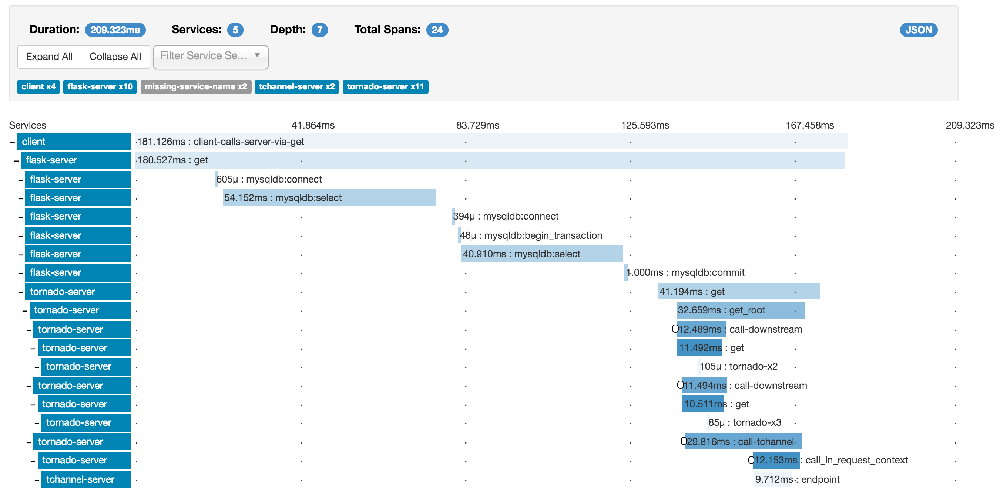
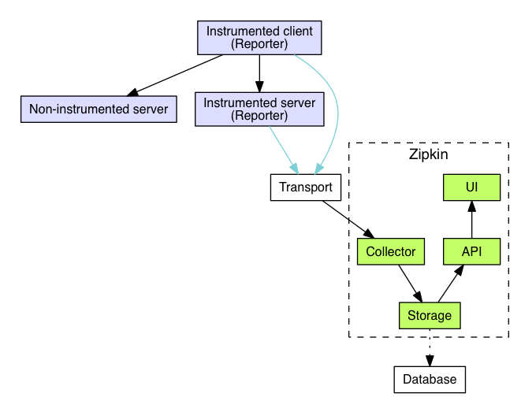

## [OpenZipkin: A distributed tracing system](http://zipkin.io/)

[TOC]

### 1 Home

#### 1.1 Zipkin是什么


Zipkin是一个分布式追踪系统。用于收集时序信息，从而优化微服务架构的时延。Zipkin的理论基础是[谷歌Dapper论文](http://research.google.com/pubs/pub36356.html)，实现了追踪数据的采集和查询。

应用程序通过植入追踪点的方式把时序信息汇报给Zipkin。Zipkin UI除了展现时序信息以外，还会通过依赖图展现每个应用程序接收、发送的请求数量，如果你正在解决系统时延或者定位系统中的某个错误，可以格局应用程序、trace数据长度、annotation以及时间戳等对所有被追踪的请求进行过滤或排序，从中选择一个被追踪的请求，通过观察每个span占整个请求时间的百分比，从而定位应用程序的问题。
>Applications are instrumented to report timing data to Zipkin. 

#### 1.2 接下来
1. 试用Zipkin，可以阅读[快速入门](http://zipkin.io/pages/quickstart)
2. 调研你的平台是否已经支持[追踪程序库](http://zipkin.io/pages/existing_instrumentations)
3. 加入[Zipkin的gitter讨论频道](https://gitter.im/openzipkin/zipkin)
4. Zipkin的代码托管在Github的[openzipkin/zipkin](https://github.com/openzipkin/zipkin/)
5. issue也在[Github](https://github.com/openzipkin/zipkin/issues)上讨论

### 2 Quickstart
这部分主要介绍构建并运行一个zipkin系统实例，以便于用户在本地试用Zipkin。本文提供三种构建方式：Java、Docker以及从源码构建运行。

如果熟悉Docker，这里推荐使用Docker部署Zipkin，否则可以选择Java或者直接从源码构建运行。不论以那种方式构建部署，Zipkin UI的URL都是http://your_host:9411。

#### 2.1 Docker
[Docker Zipkin]项目可以构建Zipkin的docker镜像，并提供了相关的脚本以及docker-compose.yml文件启动编译好的镜像。当然也可以直接执行镜像，这是最简单的方法：
```shell
docker run -d -p 9411:9411 openzipkin/zipkin
```

#### 2.2 Java
如果你安装了Java 8或者更高的版本，最快开始使用Zipkin的方法是获取[最新的发布版](https://search.maven.org/remote_content?g=io.zipkin.java&a=zipkin-server&v=LATEST&c=exec)作为可独立执行的jar文件：
```shell
wget -O zipkin.jar 'https://search.maven.org/remote_content?g=io.zipkin.java&a=zipkin-server&v=LATEST&c=exec'
java -jar zipkin.jar
```

#### 2.3 从源码运行
如果你需要开发新的功能，可以从源码运行Zipkin。你需要获取[Zipkin源码](https://github.com/openzipkin/zipkin)并编译：
```shell
# get the latest source
git clone https://github.com/openzipkin/zipkin
cd zipkin
# Build the server and also make its dependencies
./mvnw -DskipTests --also-make -pl zipkin-server clean install
# Run the server
java -jar ./zipkin-server/target/zipkin-server-*exec.jar
```

如果你发现了什么有趣的地方，欢迎和我们在[gitter](https://gitter.im/openzipkin/zipkin)上交流。

### 3 Architecture
#### 3.1 架构概览
使用了追踪功能的应用程序可以通过追踪器记录时序信息已经其他的一些元信息，例如：应用程序执行的操作。追踪功能通常是对应用程序使用的库进行埋点，因此追踪器对用户是透明的。例如：对web服务器程序的http通信库埋点，在接收请求和发送响应时就可以记录追踪数据，这些被追踪的数据叫做span。
>They often instrument libraries, so that their use is transparent to users.

追踪程序库需要稳定、低开销才能应用在生产中。因此，追踪程序库只会把追踪标识符放在用户真实的请求中传递，用于告诉下游的服务，这个请求是被追踪的。真正的追踪数据则异步的发给Zipkin后端服务，就如同应用程序向监控平台汇报指标信息一样。

例如：追踪某个应用程序中的一个操作，这个操作需要向后端发送一个http请求，此时追踪程序库需要在http请求头部添加一些标识符。除此之外，span中的其他信息，例如追踪请求的名字等都不会通过http请求传递给后端。

被追踪的应用程序通过汇报器（原文：Reporter）把追踪数据发送给Zipkin。汇报器和收集器之间会有多种传输通路。收集器把追踪数据持久化到存储中。最后，Web UI调用查询API服务展现追踪数据。

下图描述了数据通路：



参考[Zipkin支持的追踪程序库列表](http://zipkin.io/pages/existing_instrumentations)，看看你使用的平台是否Zipkin已经支持了追踪程序库。

#### 3.2 例子
如概览中所说，追踪标识符（译者注：TraceId、SpanId）是跟随用户请求一起传输的，而span数据是单独发送到Zipkin的。不论是传输追踪标识符还是span数据，都是由追踪程序库来创建追踪数据结构，并根据当前请求的具体数据填充。例如：**a tracer ensures parity between the data it sends in-band (downstream) and out-of-band (async to Zipkin).**
>As mentioned in the overview, identifiers are sent in-band and details are sent out-of-band to Zipkin. ... 
>For example, a tracer ensures parity between the data it sends in-band (downstream) and out-of-band (async to Zipkin).

下图是追踪http请求的序列图，用户代码请求资源/foo，当用户代码接收到http响应以后，追踪程序库会创建一个span，并把它异步的发送到Zipkin。

因为追踪程序库对用户代码有侵入性，因此通过异步发送span，减少因为追踪系统给用户代码带来的额外时间开销以及发送失败时的错误处理。
```
┌─────────────┐ ┌───────────────────────┐ ┌─────────────┐ ┌──────────────────┐
│ User Code   │ │ Trace Instrumentation │ │ Http Client │ │ Zipkin Collector |
└─────────────┘ └───────────────────────┘ └─────────────┘ └──────────────────┘
       │                 │                         │                 │
           ┌─────────┐
       │ ──┤GET /foo ├─> │ ────┐                   │                 │
           └─────────┘         │ record tags
       │                 │ <───┘                   │                 │
                           ────┐
       │                 │     │ add trace headers │                 │
                           <───┘
       │                 │ ────┐                   │                 │
                               │ record timestamp
       │                 │ <───┘                   │                 │
                             ┌─────────────────┐
       │                 │ ──┤GET /foo         ├─> │                 │
                             │X-B3-TraceId: aa │     ────┐
       │                 │   │X-B3-SpanId: 6b  │   │     │           │
                             └─────────────────┘         │ invoke
       │                 │                         │     │ request   │
                                                         │
       │                 │                         │     │           │
                                 ┌────────┐          <───┘
       │                 │ <─────┤200 OK  ├─────── │                 │
                           ────┐ └────────┘
       │                 │     │ record duration   │                 │
            ┌────────┐     <───┘
       │ <──┤200 OK  ├── │                         │                 │
            └────────┘       ┌────────────────────────────────┐
       │                 │ ──┤ asynchronously report span     ├────> │
                             │                                │
                             │{                               │
                             │  "traceId": "ab",              │
                             │  "id": "6b",                   │
                             │  "name": "get",                │
                             │  "timestamp": 1483945573944000,│
                             │  "duration": 386000,           │
                             │  "annotations": [              │
                             │--snip--                        │
                             └────────────────────────────────┘
```

#### 3.3 传输
被追踪的服务通过追踪程序库把被追踪的信息以span的形式发送给Zipkin的收集器。主要的传输方式有三种：HTTP、Kafka和Scribe。更多信息参考[span接收](http://zipkin.io/pages/span_receivers)。

Zipkin由四部分组成：
1. 收集器
2. 存储
3. 查询
4. web UI

#### 3.4 收集器
当追踪数据到达Zipkin的收集器守护程序以后，数据会先进行校验，如果正确就写入存储中，同时对追踪数据会创建索引用于查询。

#### 3.5 存储
Zipkin最初使用Cassandra存储数据，因为Cassandra具有良好的可扩展性、灵活的schema，并且Cassandra在Twitter中广泛使用。但是我们也提供了存储的抽象接口，用于支持其他的存储系统。除了Casssandra，Zipkin还支持的存储系统包括：ElasticSearch以及MySQL。其他的存储系统可以通过第三方的扩展实现。

#### 3.6 查询服务
在完成追踪数据的存储和索引以后，下一步就是查询数据。Zipkin通过一个简单的JSON API服务查询追踪数据，这个服务最重要的使用者是Web UI。

#### 3.7 Web UI
我们开发了一个GUI为查看追踪信息提供了美观的使用界面。Web UI提供了按照服务、时间、annotation等维度查看追踪数据的方法。注意：UI中未实现用户权限的认证功能。

### 4 Existing instrumentations
追踪数据是通过每台机器上的追踪程序库收集并且发送到Zipkin的。当一个应用程序请求另一个应用程序时，追踪标识符会通过请求传递到另一个应用程序，这样Zipkin才能将一个请求经过的所有应用程序上的追踪数据通过追踪标识符组织成若干个span。

下面介绍一下目前Zipkin支持的不同平台上的追踪程序库，使用它们请阅读相应的文档。

#### 4.1 OpenZipkin追踪程序库
下面的追踪程序库是由OpenZipkin作者维护的，代码一同托管在[OpenZipkin的Github项目组](https://github.com/openzipkin/)、在[Zipkin gitter](https://gitter.im/openzipkin/zipkin/)可以联系到这些库的作者。

|语言|库|框架|追踪标识符传递|传输方式|采样|其他|
|----|--|----|--------------|--------|----|----|
|Go|[zipkin-go-opentracing](https://github.com/openzipkin/zipkin-go-opentracing)|[Go kit](https://gokit.io/), or roll your own with [OpenTracing](http://opentracing.io/)|Http (B3), gRPC (B3)|Http, Kafka, Scribe|Yes||
|Java|[brave](https://github.com/openzipkin/brave)|Jersey, RestEASY, JAXRS2, Apache HttpClient, Mysql|Http (B3), gRPC (B3)|Http, Kafka, Scribe|Yes|Java 6 or higher|
|JavaScript|[zipkin-js](https://github.com/openzipkin/zipkin-js)|[cujoJS](http://cujojs.com/), [express](http://expressjs.com/), [restify](http://restify.com/)|Http (B3)|Http, Kafka, Scribe|Yes|Uses continuation-local-storage under to hood, so you don’t have to pass around an explicit context|
|Ruby|[zipkin-ruby](https://github.com/openzipkin/zipkin-ruby)|[Rack](http://rack.github.io/)|Http (B3)|Http, Kafka, Scribe|Yes|lc support. Ruby 2.0 or higher|
|Scala|[zipkin-finagle](https://github.com/openzipkin/zipkin-finagle)|[Finagle](https://github.com/twitter/finagle)|Http (B3), Thrift|Http, Kafka, Scribe|Yes|Library is written in Java. Propagation is defined in Finagle itself.|

#### 4.2 社区开发的追踪程序库
如果这里缺少了哪个库，请向[本网页的Github](https://github.com/openzipkin/openzipkin.github.io)提交pull reuqest补充。

如果想要自己开发另一个框架或者平台的追踪程序库，请阅读文档[追踪程序库](http://zipkin.io/pages/instrumenting)

|语言|库|框架|追踪标识符传递|传输方式|采样|其他|
|----|--|----|--------------|--------|----|----|
|C#|[ZipkinTracerModule](https://github.com/mdsol/Medidata.ZipkinTracerModule)|OWIN, HttpHandler|Http (B3)|Http|Yes|lc support. 4.5.2 or higher
|C#|[Zipkin4net](https://github.com/criteo/zipkin4net)|Any|Http (B3)|Any|Yes| 
|Go|[go-zipkin](https://github.com/elodina/go-zipkin)|x/net Context| ||Kafka|Yes| 
|Go|[monkit-zipkin](https://github.com/spacemonkeygo/monkit-zipkin/)|[Monkit](https://github.com/spacemonkeygo/monkit/)|Http (B3), easy to add others|Scribe, UDP, easy to add others|Yes| 
|Java|[cassandra-zipkin-tracing](https://github.com/thelastpickle/cassandra-zipkin-tracing)|[Apache Cassandra](http://cassandra.apache.org/)|CQL (B3)|Http, Kafka, Scribe|Yes|Java 8+
|Java|[Dropwizard Zipkin](https://github.com/smoketurner/dropwizard-zipkin)|[Dropwizard](http://www.dropwizard.io/)|Http (B3), Thrift|Http, Scribe|Yes|Java 7 or higher
|Java|[htrace](https://github.com/apache/incubator-htrace/tree/master/htrace-zipkin)|HDFS, HBase||Http, Scribe| |Yes|Java 7 or higher
|Java|[Spring Cloud Sleuth](https://github.com/spring-cloud/spring-cloud-sleuth)|Spring, Spring Cloud (e.g. Stream, Netflix)|Http (B3), Messaging (B3)|Http, Spring Cloud Stream Compatible (e.g. RabbitMQ, Kafka, Redis or anything with a custom Binder)|Yes|Java 7 or higher
|Java|[Wingtips](https://github.com/Nike-Inc/wingtips)|[Any Servlet API framework](https://github.com/Nike-Inc/wingtips/tree/master/wingtips-servlet-api), [roll-your-own](https://github.com/Nike-Inc/wingtips#generic-application-pseudo-code), [async framework support](https://github.com/Nike-Inc/wingtips#usage-in-reactive-asynchronous-nonblocking-scenarios)|Http (B3)|Http|Yes|Java 7 or higher, [SLF4J MDC support](https://github.com/Nike-Inc/wingtips#mdc_info) for auto-tagging all log messages with tracing info
|Python|[py_zipkin](https://github.com/Yelp/py_zipkin)|Any|Http (B3)|Pluggable|Yes|Generic python tracer, used in pyramid-zipkin; py2, py3 support.
|Python|[pyramid_zipkin](https://github.com/Yelp/pyramid_zipkin)|[Pyramid](http://docs.pylonsproject.org/projects/pyramid/en/latest/)|Http (B3)|Kafka, Scribe|Yes|py2, py3 support.
|Python|[swagger_zipkin](https://github.com/Yelp/swagger_zipkin)|Swagger ([Bravado](http://bravado.readthedocs.io/en/latest/)), to be used with py_zipkin|Http (B3)|Kafka, Scribe|Yes|Uses py_zipkin; py2, py3 support.
|Python|[flask_zipkin](https://github.com/qiajigou/flask-zipkin)|[Flask](http://flask.pocoo.org/)|Http (B3)|Pluggable|Yes|Uses py_zipkin; py2, py3 support.
|Scala|[akka-tracing](https://github.com/levkhomich/akka-tracing)|[Akka](https://akka.io/), [Spray](https://spray.io/), [Play](https://www.playframework.com/)|Http (B3), Thrift|Scribe|Yes|Java 6+, Scala 2.10+, activator templates for Akka and Play

### 5 Data Model
为了说明Zipkin展现的追踪数据，我们会结合一个具体的Zipkin数据模型，通过比较UI展现追踪结果以及这份结果对应的具体数据，我们发现：

* 上下游模块位于不同的span中
* 如果一个span中有cs标记，那么这个span会记录一个key为sa的annotation，用于表示这个span的下游。这样做是为了当下游不支持追踪时（例如MySQL），尽可能多的追踪信息。

首先我们从UI上看到追踪数据：


等效的追踪数据的Zipkin数据模型：
```json
[
    {
      "traceId": "bd7a977555f6b982",
      "name": "get",
      "id": "bd7a977555f6b982",
      "timestamp": 1458702548467000,
      "duration": 386000,
      "annotations": [
        {
          "endpoint": {
            "serviceName": "zipkin-query",
            "ipv4": "192.168.1.2",
            "port": 9411
          },
          "timestamp": 1458702548467000,
          "value": "sr"
        },
        {
          "endpoint": {
            "serviceName": "zipkin-query",
            "ipv4": "192.168.1.2",
            "port": 9411
          },
          "timestamp": 1458702548853000,
          "value": "ss"
        }
      ],
      "binaryAnnotations": []
    },
    {
      "traceId": "bd7a977555f6b982",
      "name": "get-traces",
      "id": "ebf33e1a81dc6f71",
      "parentId": "bd7a977555f6b982",
      "timestamp": 1458702548478000,
      "duration": 354374,
      "annotations": [],
      "binaryAnnotations": [
        {
          "key": "lc",
          "value": "JDBCSpanStore",
          "endpoint": {
            "serviceName": "zipkin-query",
            "ipv4": "192.168.1.2",
            "port": 9411
          }
        },
        {
          "key": "request",
          "value": "QueryRequest{serviceName=zipkin-query, spanName=null, annotations=[], binaryAnnotations={}, minDuration=null, maxDuration=null, endTs=1458702548478, lookback=86400000, limit=1}",
          "endpoint": {
            "serviceName": "zipkin-query",
            "ipv4": "192.168.1.2",
            "port": 9411
          }
        }
      ]
    },
    {
      "traceId": "bd7a977555f6b982",
      "name": "query",
      "id": "be2d01e33cc78d97",
      "parentId": "ebf33e1a81dc6f71",
      "timestamp": 1458702548786000,
      "duration": 13000,
      "annotations": [
        {
          "endpoint": {
            "serviceName": "zipkin-query",
            "ipv4": "192.168.1.2",
            "port": 9411
          },
          "timestamp": 1458702548786000,
          "value": "cs"
        },
        {
          "endpoint": {
            "serviceName": "zipkin-query",
            "ipv4": "192.168.1.2",
            "port": 9411
          },
          "timestamp": 1458702548799000,
          "value": "cr"
        }
      ],
      "binaryAnnotations": [
        {
          "key": "jdbc.query",
          "value": "select distinct `zipkin_spans`.`trace_id` from `zipkin_spans` join `zipkin_annotations` on (`zipkin_spans`.`trace_id` = `zipkin_annotations`.`trace_id` and `zipkin_spans`.`id` = `zipkin_annotations`.`span_id`) where (`zipkin_annotations`.`endpoint_service_name` = ? and `zipkin_spans`.`start_ts` between ? and ?) order by `zipkin_spans`.`start_ts` desc limit ?",
          "endpoint": {
            "serviceName": "zipkin-query",
            "ipv4": "192.168.1.2",
            "port": 9411
          }
        },
        {
          "key": "sa",
          "value": true,
          "endpoint": {
            "serviceName": "spanstore-jdbc",
            "ipv4": "127.0.0.1",
            "port": 3306
          }
        }
      ]
    },
    {
      "traceId": "bd7a977555f6b982",
      "name": "query",
      "id": "13038c5fee5a2f2e",
      "parentId": "ebf33e1a81dc6f71",
      "timestamp": 1458702548817000,
      "duration": 1000,
      "annotations": [
        {
          "endpoint": {
            "serviceName": "zipkin-query",
            "ipv4": "192.168.1.2",
            "port": 9411
          },
          "timestamp": 1458702548817000,
          "value": "cs"
        },
        {
          "endpoint": {
            "serviceName": "zipkin-query",
            "ipv4": "192.168.1.2",
            "port": 9411
          },
          "timestamp": 1458702548818000,
          "value": "cr"
        }
      ],
      "binaryAnnotations": [
        {
          "key": "jdbc.query",
          "value": "select `zipkin_spans`.`trace_id`, `zipkin_spans`.`id`, `zipkin_spans`.`name`, `zipkin_spans`.`parent_id`, `zipkin_spans`.`debug`, `zipkin_spans`.`start_ts`, `zipkin_spans`.`duration` from `zipkin_spans` where `zipkin_spans`.`trace_id` in (?)",
          "endpoint": {
            "serviceName": "zipkin-query",
            "ipv4": "192.168.1.2",
            "port": 9411
          }
        },
        {
          "key": "sa",
          "value": true,
          "endpoint": {
            "serviceName": "spanstore-jdbc",
            "ipv4": "127.0.0.1",
            "port": 3306
          }
        }
      ]
    },
    {
      "traceId": "bd7a977555f6b982",
      "name": "query",
      "id": "37ee55f3d3a94336",
      "parentId": "ebf33e1a81dc6f71",
      "timestamp": 1458702548827000,
      "duration": 2000,
      "annotations": [
        {
          "endpoint": {
            "serviceName": "zipkin-query",
            "ipv4": "192.168.1.2",
            "port": 9411
          },
          "timestamp": 1458702548827000,
          "value": "cs"
        },
        {
          "endpoint": {
            "serviceName": "zipkin-query",
            "ipv4": "192.168.1.2",
            "port": 9411
          },
          "timestamp": 1458702548829000,
          "value": "cr"
        }
      ],
      "binaryAnnotations": [
        {
          "key": "jdbc.query",
          "value": "select `zipkin_annotations`.`trace_id`, `zipkin_annotations`.`span_id`, `zipkin_annotations`.`a_key`, `zipkin_annotations`.`a_value`, `zipkin_annotations`.`a_type`, `zipkin_annotations`.`a_timestamp`, `zipkin_annotations`.`endpoint_ipv4`, `zipkin_annotations`.`endpoint_port`, `zipkin_annotations`.`endpoint_service_name` from `zipkin_annotations` where `zipkin_annotations`.`trace_id` in (?) order by `zipkin_annotations`.`a_timestamp` asc, `zipkin_annotations`.`a_key` asc",
          "endpoint": {
            "serviceName": "zipkin-query",
            "ipv4": "192.168.1.2",
            "port": 9411
          }
        },
        {
          "key": "sa",
          "value": true,
          "endpoint": {
            "serviceName": "spanstore-jdbc",
            "ipv4": "127.0.0.1",
            "port": 3306
          }
        }
      ]
    }
  ]  
```

### 6 Instrumenting a library
这部分会讨论一个高级话题，继续阅读之前，可以[在这里](http://zipkin.io/pages/existing_instrumentations)检查一下你所用的平台是否已经支持了一个追踪程序库。如果没有，并且你想自己实现一个追踪程序库，那么首先，请通过[https://gitter.im/openzipkin/zipkin](https://gitter.im/openzipkin/zipkin)让我们知道你的这个想法，我们会非常高兴自始至终帮助你完成追踪程序库的设计和实现。

#### 6.1 概览
为了追踪一个程序库，首先需要理解并构造下面这些元素：

1. 核心数据结构：被收集并发送到zipkin的信息
2. 追踪标识符：对追踪信息按照逻辑顺序重新组装时需要的标记信息。
    * 生成标识符：如何生成标识符，其中哪些需要在模块之间调用时被继承
    * 传递追踪信息：除了追踪数据和标识符以外，还有一些附加信息传递给zipkin
3. 时间戳和耗时：记录操作的时序信息

> Communicating trace information - additional information that is sent to Zipkin along with the traces and their IDs.

好吧，准备好了？让我们开始。

#### 6.2 核心数据结构
核心数据结构在[thrift注释](https://github.com/openzipkin/zipkin-api/blob/master/thrift/zipkinCore.thrift)中有详细的文档，这里对它们做一个概括的描述，便于你开始实现追踪程序库：

#### Annotation
Annotation用于记录某个实际上发生的事件，下面是用于记录请求开始和结束的核心Annotation：

* cs(Client Start)：客户端发起了请求，这个span从这个事件开始
* sr(Server Receivce)：服务端接收到请求，并且即将开始处理它。sr和cs之间的时间差是网络耗时以及客户端和服务端的时钟抖动。
* ss(Server Send)：服务端完成请求的处理，并且把请求发送给客户端。ss和sr之间的时间差是服务端处理请求的耗时。
* cr(Client Receive)：客户端接收到服务端的响应，这个span从这里结束。当这个Annotation被记录时，标志着客户端调用服务端的RPC已经完成了。

除了上述核心Annotation以外，还可以在一个请求的生命周期中记录其他的Annotation，从而提供更细粒度的追踪。例如：当服务端开始以及完成一个耗时间的计算时，可以分别添加一个Annotation，这样可以知道处理一个请求之前、之后相对中间的计算所花费的时间比例。

#### BinaryAnnotation
BinaryAnnotation不记录时间，它们用于提供和RPC相关的额外信息。例如：当调用一个HTTP服务时，通过BinaryAnnotation记录HTTP请求的URI，便于分析HTTP服务的请求量。BinaryAnnotation还可以用于Zipkin Api以及UI的准确匹配。

#### Endpoint
Annotation和BinaryAnnotation都会关联一个endpoint。有两个例外：这里的endpoint是和被追踪的服务是关联的。例如：在Zipkin UI的下拉列表（下图中红框）的服务名称是和Annotation.endpoint.serviceName或BinaryAnnotation.endpoint.serviceName对应的，为了便于使用，Endpoint.serviceName的数量会被限制，例如，服务名中不应该包含变量或者随机数。

>With two exceptions, this endpoint is associated with the traced process. For example, the service name drop-down in the Zipkin UI corresponds with Annotation.endpoint.serviceName or BinaryAnnotation.endpoint.serviceName. For the sake of usability, the cardinality of Endpoint.serviceName should be bounded. For example, it shouldn’t include variables or random numbers.


#### Span
某个特定的RPC对应的一系列Annotation和BinaryAnnotation的集合。span包含标识信息，例如traceid、spanid、parentspanid、rpc名字等。

span通常很小，例如：序列化以后的span通常小于KB级别，当span大小超过这个数量级以后会导致很多问题，例如：触发kafka的消息大小上限（1MB）。即使可以增加消息大小上限，span体积太大会增加开销并且降低追踪系统的可用性。基于这一点，要慎重选择数据，只追踪对于解释系统行为有帮助的数据，其他的数据就不要存了。

#### Trace
由一个根span组成的span集合就是一个trace，通过收集所有traceid相同的span，就可以构建出一个trace。span会根据spanid和parentspanid重新排列成一棵树，从而展现一个请求经过整个系统的路径。

#### 6.3 追踪标识符
为了把一系列span重组成一棵追踪树，需要记录三部分信息：

* trace id：64位或128位，唯一标识一次追踪，其中的所有span都共享相同的trace id。
* span id：64位，唯一标识一次追踪中的某个span，span id和trace id可以相同也可以不相同，二者没啥关系。
* parent span id：只有子span才会有，没有这个字段的span就是一次追踪的根。

#### 生成标识符
让我们看一下标识符是怎样产生的。

当请求中没有标识符时，我们会生成一个随机的trace id和span id。span id可以复用trace id的低64位，也可以不和trace id相同。

如果请求中有追踪标识符，就使用追踪标识符记录sr和ss事件，因为这两个事件和cs和cr共同组成了对一次调用的追踪。

如果一个服务又调用了下游服务，需要在当前span上创建一个新的子span。子span和父span具有相同的trace id，子span的span id是新生成的（例如64位随机数），子span的parent span id是前一个span的span id。

注意：如果这个服务调用了多个下游，需要重复上面的过程，每个子span的trace id和parent span id都是相同的，但是span id都是新生成且互不相同的。

#### 追踪信息的传递
上下游之间需要传递追踪标识符（原文：trace information），以便于重组完整的追踪树。下面五个信息是必需的：

* trace id
* span id
* parent span id
* sampled：让下游服务知道对于这个请求，是否需要记录追踪标识符。
* flags：支持创建、传递特殊功能的标记，比如：告诉下游这是一个调试请求。

>Sampled - Lets the downstream service know if it should record trace information for the request.

[这里](https://github.com/openzipkin/b3-propagation)提供了追踪信息的格式。

[Finagle](https://twitter.github.io/finagle/)实现了通过HTTP和thrift请求传递追踪标识符信息。其他的上下游通信协议需要自己增加追踪信息。
>Other protocols will need to be augmented with the information for tracing to be effective.

#### 追踪采用是在系统入口决定的
下游服务需要遵循上游服务的追踪抽样决策，如果追踪信息中没有sampled字段，由当前服务来判断是否对这个请求进行追踪，并通过sampled字段传递给下游服务。这样简化了追踪抽样的理解和配置，并且确保了一个请求要么在所有服务上都追踪，要么就全不追踪。

注意，flags标志可以强制对一个请求进行追踪，它的优先级高于任何的抽样规则。flags标志对于存储层抽样也有效，这个是在Zpikin的服务端配置的。

#### HTTP传递追踪信息
通过HTTP头部的B3部分传递追踪信息，B3是Zipkin原始的名字：BigBrotherBird。追踪标识符用[十六进制字符串编码](https://github.com/twitter/finagle/blob/master/finagle-core/src/main/scala/com/twitter/finagle/tracing/Id.scala)：

* X-B3-TraceId：128位或者64位十六进制（必需）
* X-B3-SpanId：64位十六进制（必需）
* X-B3-ParentSpanId：64位十六进制（根span中没有）
* X-B3-Sampled: 布尔值（1或0，可选）
* X-B3-Flags: 1表示debug请求（可选）

更多的信息参考[B3的说明文档](https://github.com/openzipkin/b3-propagation)

#### thrift传递追踪信息
Finagle的客户端和服务端会在建立链接时协商能否处理额外的信息，如果可以，那么追踪信息会存储在thrift消息的头部传递。

#### 6.4 时间戳和耗时
span会记录时间信息和元数据（Annotation等发送到zipkin的数据）。这里面最重要的一个问题是合理的记录时间戳和耗时。
>Span recording is when timing information or metadata is structured and reported to zipkin.

#### 时间戳是微秒
所有的zipkin时间戳都是相对epoch的微秒（不是毫秒），使用微秒是为了最大限度的获取测量的准确性。例如：clock_gettime或者简单的把epoch毫秒乘以1000。时间戳用64位有符号整数存储，负数是不合法的时间戳。
>All Zipkin timestamps are in epoch microseconds (not milliseconds). This value should use the most precise measurement available. For example, clock_gettime or simply multiply epoch milliseconds by 1000. Timestamps fields are stored as 64bit signed integers eventhough negative is invalid.

微秒精度主要是支持“local span”（译者注：指的是同一台机器上的span），例如：微妙的精度可以区分出事件发生先后次序的微小差别。
>Microsecond precision primarily supports “local spans”, which are in-process operations. For example, with higher precision, you can tell nuances of what happened before something else.

所有的时间戳都会有错误，比如：机器之间的时钟的偏差、时间服务器时钟倒退。因此，如果可能的话，span需要记录耗时信息。

#### 耗时也是微秒
尽管可以获取纳秒精度的时间信息，但是zipkin使用微秒的原因如下：

1. 耗时和时间戳使用相同的单位简化了数学计算。例如：当你正在分析一个span时，如果时间都是相同的单位，就比较容易比较。
2. 记录一个span这个操作的时间开销通常不固定，可能是在微秒级，因此耗时如果使用比微秒高的精度，本身就不准确。

Zipkin未来的版本可能重新考虑这个话题，目前所有的时间都是微秒

#### 什么时候设置时间戳和耗时
时间戳和耗时都必须由创建span的机器设置。下面是记录时间戳和耗时的最简单的逻辑：
```
unless (logging "sr" in an existing span) {
 set Span.timestamp and duration
}
```

zipkin会把trace id相同、span id也相同的span合并起来，最常见的场景是把客户端生成的包含cs和cr的span和服务端生成的包含sr和ss的span合并起来。例如：客户端创建一个span，记录cs信息，并通过B3协议把追踪信息传递给服务端，服务器继续在span上记录sr信息。因为是客户端创建了span，因此客户端记录时间戳和耗时，它们和cs、cr的时间是匹配的。服务端因为没有创建span，所以它不应该记录时间戳和耗时。

另一个场景是当服务端创建一个根span（客户端没有植入追踪库，例如浏览器）。因为它确定没有收到B3头部，所以服务端会创建span，因此服务端需要记录根span的时间戳和耗时。

注意：如果一个span不完整，你只能设置时间戳，不能设置耗时，因为没有足够的信息设置耗时。

#### 如果不设置时间戳和耗时会怎么样？
时间戳和耗时是在2015年新增的字段，此时zipkin已经诞生3年了，不是所有的追踪程序库都会记录这些字段。如果这些字段没有设置，zipkin会在查询时添加这些字段（根据啥添加？），这一点做的不够好。

如果span中没有耗时，那么查询时就不能把耗时作为索引。另外，`local (in-process) spans`可能没有Annotation，因此只有设置了时间戳，才能查询它们。

当追踪程序库没有设置耗时时，zipkin会在查询时尝试计算出耗时，通过时间戳计算出耗时，这个方法可能存在一些问题，例如当span中的时间戳被NTP服务更新过，zipkin计算出的耗时就会是错误的。
>When duration isn’t set by instrumentation, Zipkin tries to derive duration at query time, it has to use the problematic method of timestamp math. Ex. if an NTP update happened inside the span, the duration Zipkin caculates will be wrong.

>Finally, there’s a desire for many to move to single-host spans. The migration path towards this is to split dual-host RPC spans into two. When instrumentation logs timestamp only for spans it owns, splitting collectors have a heuristic to distinguish a server-initiated root span from a client-initiated, dual-host one.

>The bottom-line is that choosing not to record Span.timestamp and duration will result in less accurate data and less functionality. Since it is very easy to record these authoritatively before reporting, all Zipkin instrumentation should do it or ask someone to help them do it.

### 7 Transports
传输用于从被追踪的服务中收集span，并把它们转化为Zipkin的标准span格式，然后发给存储层，传输通路模块化实现了支持不同格式的追踪数据生产者，Zipkin支持HTTP、kafka和Scribe三种传输格式。
