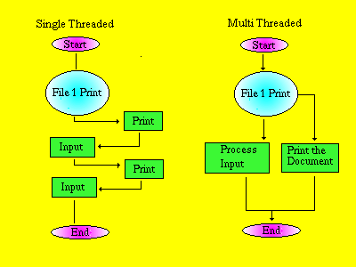

# [线程](http://www.tldp.org/LDP/LG/issue23/flower/threads.html)

现在操作系统中看到的大部分进程都是单线程的，这意味着在进程中只有一条执行路径。单线程的进程如果需要处理许多子任务时只能顺序的执行这些任务，每个子任务必须等待前一个子任务完成以后才能开始，这种安排方式会降低处理器使用效率和计算机的响应。

下图给出了一个例子用于说明多线程的优势。假如一个用户需要打印一个文档，首先初始化一个用户进程用于接收输入并选择打印的文档然后开始打印操作。显然，用户进程需要能够继续检查其他用户的命令并初始化打印操作，为了实现这一点，有两种选择：

1. 进程周期的停止打印，轮询是否有用户输入，然后继续打印
2. 等待当前的打印完成再响应其他用户的输入

这两种选择都延长了打印时间，降低了响应速率。取而代之的是，多线程进程有多个执行路径，从而可以将打印操作委托给不同的执行线程。输入线程和打印线程可以并行执行直到打印完成。

每个线程都能够访问它所在进程的所有资源，进程的全局变量是对所有线程可见的。多线程进程中，each thread 'believes' it has independent access to its own 'virtual machine' with the scheduler being responsible for allocation of CPU quanta to threads to optimise throughput efficiency.

同一个进程的线程共享进程的文件指针、代码段等资源。在同一个进程的线程之间切换的开销比在进程之间切换小得多，这是因为前者需要保存的上下文数据更少。因此线程通常被叫做轻量级进程（LWP），然而普通的进程则相应的要重量级一些。通常，当线程上下文切换时，只有PC指针和寄存器组需要保存在PCB中，然而，因为重量级的进程不共享这些资源，因此当进程切换时，还需要保存很多额外的信息。

尽管线程有上面描述的众多优势，它们同样有不足，其中之一就是任何一个线程异常都会导致进程崩溃。多线程编程比多进程复杂得多，因为内核代码和库代码必须是100%可重入的。需要特别小心的是临界代码段中不能发生抢占，否则会导致其他线程访问到不一致的数据。另一个问题是“当一个线程fork出进程时发生了什么”，it must be defined how threads within a process are affected in this case.

### Linux
Linux有内核空间和用户空间两种线程。

用户空间的线程即进程内部相互协作和切换的多任务（原文：User space threads consist of internal cooperative multitasking switches between sub tasks defined with a process.），线程可以发送信号、执行上下文切换以及被定时器唤醒并释放CPU。线程切换时，用户空间的堆栈会被保存。通常，用户线程比内核线程切换快。用户空间线程的一个缺点是容易因为一个线程不释放CPU导致其他（同进程的）线程饿死。此外，如果一个线程因为等待资源阻塞时，其他线程也会阻塞。最后，用户线程也不支持SMP，即使机器有多个处理器可用。

内核空间的线程由内核向进程分配一个线程表实现。内核在进程的CPU时间片中调度线程。内核线程在上下文切换时开销有少部分增加，但是带来的收益包括：真的抢占式多任务、避免线程饿死以及I/O阻塞的问题、内核线程可以通过SMP实现执行效率随CPU数量线性提高。

### Windows NT
和进程类似，Windows NT中的线程也实现为对象。Certain attributes of a thread may restrict or qualify the attributes applicable to the overall process.线程拥有一个上下文属性，用于操作系统实现正确的上下文切换。

Windows NT的Posix子系统不支持多线程，只有OS/2和Win 32子系统支持。

所有线程受内核控制，内核会调度线程使用CPU的优先级。内核不使用线程句柄来访问线程，它对线程有自己的视角，即内核线程对象，内核通过这个对象来访问线程。

Windows NT支持SMP，线程通过定义处理器亲和性选择自己可以运行的处理器。（原文：Windows NT threads support SMP, with individual threads (and processes for that matter) having a defined processor affinity which can define on which of a selection of available processors the thread may be run.）