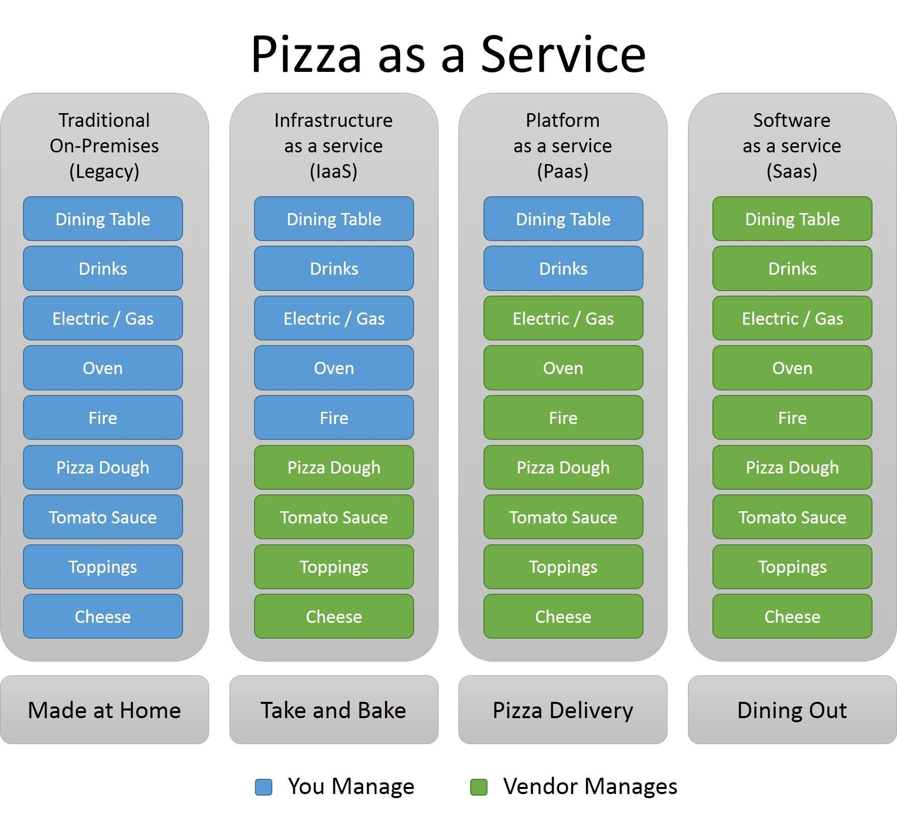
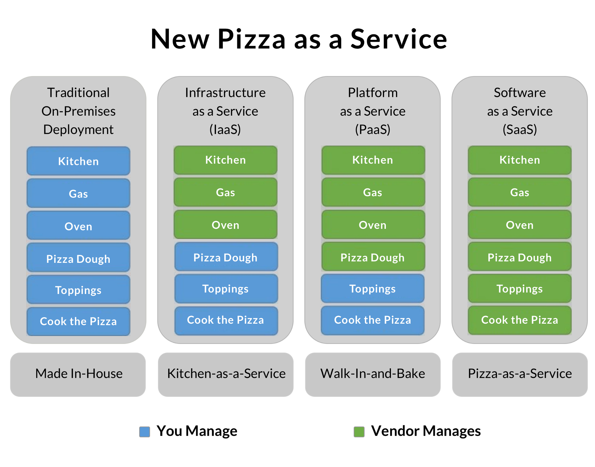

## [SaaS, PaaS and IaaS explained in one graphic](https://m.oursky.com/saas-paas-and-iaas-explained-in-one-graphic-d56c3e6f4606)

<h4 align="right">And how the original Pizza-as-a-Service illustration is wrong.</h4>

### TLDR
Pizza-as-a-Service的原图是下面第一张图片，第二张图片是作者对原图的改进，目的是使Pizza-as-a-Service比喻更符合IaaS、PaaS、SaaS。两张图片（或者是本文作者和Alert Barron对Pizza-as-a-Service的描述）的相同点都是把Pizza比作云计算服务，不同点在于**什么是制作Pizza的基础设施**，Alert Barron认为食材是基础设施，而本文作者认为是厨房，我认同后者。

### 翻译

Pizza-as-a-Service比喻是[Alert Barron在2014年](https://www.linkedin.com/pulse/20140730172610-9679881-pizza-as-a-service)首先提出的，它形象的表示了Infrastructure-as-a-service (IaaS)、Platform-as-a-service (PaaS)和Software-as-a-service (SaaS)的区别。乍看这个比喻很精妙，但是如果你细细分析一下，这个比喻中很多概念难以构成体系（原文：it falls apart）。下面这张图想表现的原意是（从IaaS到SaaS）你需要做的东西越来越少，图中按照“外包程度”递增的顺序列出了制作Pizza所需的元素（译者注；指的是Dining Table、Drinks、Electri/Gas等），但是这些元素不能比较的。我会针对原图中的服务为那些想从中选择它们的用户提供更好的比较建议。

>This diagram wants to illustrate that you need to do less and less, but the items that are listed and increasingly “outsourced” don’t fit the comparison. I’ll look at the services in the original diagram and suggest a better comparison for people who want to choose which services to use. 

#### A good visualization of a false concept.

Pizza-as-a-Service想表示的基本概念是：每种方式你都能获得一份Pizza，有些方式中你需要从头到尾自己做，但是有些方式中你可以让别人帮你完成。

* Traditional On-Premises Deployment: Made at Home
* Infrastructure-as-a-Service: Take and Bake
* Platform-as-a-Service: Pizza Delivery
* Software-as-a-Service: Dining out

图中你需要完成的工作量从大到小为：Made at home > Take and bake > Pizza delivery > Dining out

首先我们先看前两种方式：如果“Traditional On-Premises Deployment”表示“Made at home”，为什么“Infrastructure-as-a-Service”表示“Take and bake”？

乍看起来Iaas好像是服务提供商卖给你已经预制作好的Pizza，所以你只要在自己家里的厨房烤好就行，不会因为制作过程把厨房搞的一团糟。然而，这不是“Infrastructure-as-a-Service”和“Traditional On-Premises Deployment”的区别所在。

#### The X-aaS concept should be interpreted the other way round.

我们不妨换个方式不再从“用户需要的工作越来越少”的角度考虑，我们考虑一个可以定制化的产品，服务提供商通过不断减少帮用户做的工作来增加产品的可定制性。

在X-aaS这个概念中，你不需要担心X具体表示什么，它可以是基础设置、平台、软件或者是Pizza。我将会逐步分析如何得到一个可定制程度逐渐增加的Pizza，而不是直接把X-aaS模型生搬硬套到实际生活中的能够获得一份Pizza的方式上。

#### Enjoy your packaged meal: Pizza-as-a-Service.
Pizza-as-a-Service表示你可以订购一个完全成品的Pizza，它是由Pizza店里的某位厨师按照设计配方、准备食材并烘焙好，你打电话预定，Pizza送到了以后还是热的，直接吃就行。

在SaaS的世界里面，我们（用户）只需要注册就能使用服务，我们可以对服务的特性、产品界面样式以及users (pizza toppings)进行定制，我们不需要操心服务是怎么部署的、使用了哪种程序框架（just like how the service providers put our orders together for us）。这也就意味着我们不能选择奶酪的品牌以及烘焙的时间，如果你不喜欢Pizza的饼皮，那么你只能换一家。

>We can customize some features, layouts, or users (pizza toppings), but we never need to worry about the deployment and framework the project is used (just like how the service providers put our orders together for us).

那么Pizza-as-a-Serice下一层的服务模式是什么呢？

#### Semi-customized: Ready-to-cook.
Alert Barron原图中“take-and-bake”（用于比喻IaaS）是基本准确的，但是这个比喻中缺少一些关键概念。“take-and-bake”不允许顾客定制（译者注：Pizza店做好以后顾客拿走直接烤），但是IaaS和PaaS是允许用户对服务进行定制的，它们帮你解决了一些你不想处理的基础设施，并提供了定制基础设施的API接口，你只需要从基础设施中选择你需要的部分就行了。

>The idea of “take-and-bake” in the original diagram was close, but it misses a few key ideas. The take-and-bake doesn’t allow customization, which is what IaaS and PaaS offer. 

“take-and-bake”的下一层（译者注：指的是进一步增加用户对Pizza的定制程度）应该是走进一个厨房，厨房里面准备好了可以制作Pizza的食材包。IaaS和PaaS就是这样的一个厨房，当你想要制作你自己的Pizza时不需要操心食材的购买和预处理以及准备烘焙Pizza需要的工具。你只需要按照你的口味把面团揉成合适的大小和厚度、把洗好的食材放在揉好的饼皮上，然后就直接放在厨房已经准备好的烤箱中就行了。

如果你使用的是IaaS和PaaS，你只需要关注业务逻辑以及实现你的用户接口即可，你的服务是运行在IaaS或PaaS提供商提供的可靠系统平台上，他们会帮你管理机器和硬件。

这个选项可能不适用于所有的用户，至少你需要一些Pizza的制作技巧，例如把面团揉成圆形的饼皮。

#### Fully customized: Kitchen-as-a-Service.
厨房中的设备（就好比数据中心的）基础设施，对于工程师来说，你的代码就运行在基础设施上。除了服务器，数据中心的基础设施还包括运行时（译者注：原文是runtime，我觉得指操作系统）、存储和网络。没有这些，你的产品啥也干不了，但是这些基础设施不会影响你产品本身的功能和特性。

回到Pizza的比喻中，下一层是你自己购买符合你口味的食材，甚至是精细到食材的品牌。除了食材，你不需要操心烤箱、擀面杖、切Pizza的刀具以及厨房的桌子够不够大。

现在你可以完全控制Pizza的制作了，但是可能租来的厨房不是每种你想用的工具都有。

#### Fully in-house: Prepare ingredients + cooking equipment from scratch.
对于自制Pizza的强烈需求者，他们不仅要选择制作Pizza的食材并头从做起，还需要完整控制厨房中的所有工具：烤箱必须有特定的功能设置并且还要足够大，其他厨房没有的烤Pizza的石头或者是让面团在冰箱中最合适的位置放置一晚，最后，他们还要在Pizza刚出烤箱时撒上一点自制的红辣椒油，平常它的新鲜风味。

你可能认为这样做是有点过头了，但是在现实世界中，如果你不能找到一个服务提供商可以让你自定义服务部署，例如防火墙的设置或者特定的网络设置，那么你自己建设数据中心是必需的。

#### Examples of IaaS, Paas, and SaaS.

SaaS (Software-as-a-Service)：你可以注册并且直接使用软件，例如：[Zendesk](http://zendesk.com/)，Paypal，甚至是其他更面向用户的软件Twitter、Fackbook、Instagram。

PaaS (Platform-as-a-Service)：你可以在平台上构建你的软件，例如：[Heroku](http://heroku.com/)，[SalesForce](http://force.com/)，Google App Engine。除此以外，你还可以利用市场上的Backend-as-a-Service（原文：you can also leverage the benefits from some Backend-as-a-Service in the market.），例如：[Skygear](http://skygear.io/)，Firebase，Kii，Kiney。

IaaS (Infrastructure-as-a-Service)：为你的App部署提供场地（虚拟机），例如：[Amazon Web Service EC2](https://aws.amazon.com/ec2/)，Digital Ocean，RackSpace Cloud。

On-Premises Deployment：你有自己的数据中心和服务器，它们完全可以根据你的需求定制。

Iaas和Pass帮我们省去了很多准备工作，所以我们可以定制我们的“Pizza”，然后很快的烘焙出来。最适合你的产品的服务类型就是最好的。希望这些例子解释清楚了这些概念。
