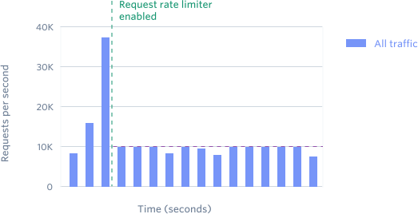
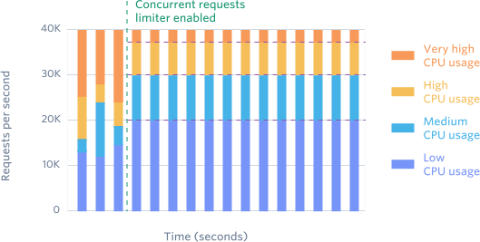
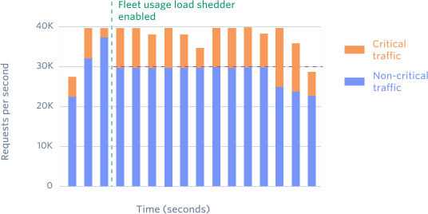
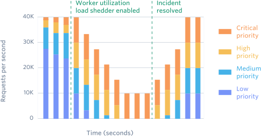

## [Scaling yourAPIwith rate limiters](https://stripe.com/blog/rate-limiters)

### TLDR
1. ..., we sometimes need to drop low-priority requests to make sure that more critical requests get through. This is called load shedding.
2. At Stripe, we operate 4 different types of limiters in production. 
    1. Request rate limiter: You can use our API 1000 times a second.
    2. Concurrent requests limiter: You can only have 20 API requests in progress at the same time.
    3. Fleet usage load shedder: Using this type of load shedder ensures that a certain percentage of your fleet will always be available for your most important API requests. If our reservation number is 20%, then any non-critical request over their 80% allocation would be rejected with status code 503.
    4. Worker utilization load shedder: 
        1. If your workers start getting backed up with requests, then this will shed lower-priority traffic. 
        2. This load shedder limits the impact of incidents that are already happening and provides damage control. （避免次生故障）
        3. I got rid of testmode traffic! Everything is fine! I brought it back! Everything is awful! （调整和恢复的速率很重要）
3. Our recommendation is to follow the following steps to introduce rate limiting to your infrastructure:
    1. start by building a Request Rate Limiter
    2. introduce the next three types of rate limiters over time to prevent different classes of problems. 
    2. put them behind feature flags to turn them off easily at any time
    3. rely on very good observability and metrics to see how often they’re triggering.

### 翻译
可用性和可靠性对于所有web应用程序和API至关重要。如果你提供了一个API 服务，你可能体会过流量突增对服务质量的影响，甚至可能造成对所有用户的服务中断。

最初发生这种情况时，扩容基础设施以适应用户增长是合理的。但是对于生产环境中的API服务，不仅需要采用类似[idempotency](https://stripe.com/blog/idempotency)的技术确保服务的鲁棒性，还需要确保服务的可扩展性，不能因为一个偶然的或者故意的坏因素影响其可用性。

限制流量可以使API服务在下面的场景中更可靠：

* 某个用户造成了流量飙升，我们需要确保服务对其他用户可用。
* 某个用户因为一个执行错误的脚本发送大量请求，或者更糟的是某个用户试图恶意攻击服务器。
* 用户发送了大量低优先级请求，但你希望确保低优先级的请求不会影响其他高优先级请求。例如：用户发送大量分析数据请求（低优先级请求）可能会影响其他用户的关键交易请求。
* 你的系统内部产生错误，导致无法处理所有请求，不得不丢弃低优先级的请求。

在Stripe，我们发现通过精心设计和实现一些[限流](https://en.wikipedia.org/wiki/Rate_limiting)策略，帮助我们保证API服务对所有用户的可用性。在这篇文章中，我们将详细介绍效果最好的限流策略、如何对API请求进行优先级划分，以及如何安全地使用限流器而不影响现有用户的工作流程。

#### 限流器和减载
限流器用于控制在网络上发送或接收的流量速率。什么时候应该使用限流器？如果你的用户能够接受改变访问API服务器的速率同时又不影响请求服务的结果，那么使用限速器就是合适的。如果在请求与请求之间插入间隔不可行（比如对于实时事件），那么就需要这篇文章以外的策略（通常来说需要对基础设施扩容）。

>If your users can afford to change the pace at which they hit your API endpoints without affecting the outcome of their requests, ... If spacing out their requests is not an option, ...

我们用户会发起很多请求，例如：批处理支付请求会导致API流量持续升高。除了一些极少数的情况，用户总是可以以一定间隔发起请求（原文：spread out their requests），而不受限流器的影响。

限流器对于日常大部分使用场景是十分高效的，但在一些事故情况下（例如：服务响应时间比通常慢），我们需要丢弃低优先级的请求以确保更多关键请求的能够被处理，这称为负载降级（load shedder）。降级不经常发生，但是它是保持Stripe可用性的关键部分。

负载降级可以根据系统的整体状态而不是正在请求的用户来进行决策。它可以帮助我们应对突发事件，因为它能在其他部分都异常的情况下，确保核心部分正常工作。

#### 使用不同类型的限流器
一旦你理解了限流器能够提升API的可靠性，你应该根据场景选择合适的限流器。

Stripe在生产环境中使用4种不同类型的限流器。第一种，请求速率限制器，它也是最重要的一个。如果你想提升你的API的鲁棒性，我推荐你从它开始。

#### 请求速率限流器
该限流器限制每个用户每秒可发送N个请求。它是大多数API有效管理大量流量能够使用的第一个工具。

我们的（这个）限流器会经常被请求触发。本月已经拒绝了数百万个请求，特别是对于用户无意运行脚本产生的测试请求。

我们的API在测试和生产模式下提供相同的速率限制行为，这样做有利于开发人员的体验：在从开发切换到生产模式时，程序或脚本不会遇到（只有在生产环境中生效的）副作用。

在分析了我们的流量模式之后，我们把这种限流器应用到“实时事件导致流量突然上涨并且短暂的超过容量限制”这个场景中，比如用于电商中的抢购。

>After analyzing our traffic patterns, we added the ability to briefly burst above the cap for sudden spikes in usage during real-time events (e.g. a flash sale.)

Request rate limiters restrict users to a maximum number of requests per second.

#### 并发请求限流器
第一种请求限流器是限制“你只能每秒访问我们的API 1000次”，这个限流器是限制“同一时间你只能有20个API请求在处理”。有些API服务（原文：API endpoint）容易造成资源争抢，（当抢不到资源时会导致）用户等待API返回结果失败并且不得不重试。这些重试继续加剧了已经超载的服务。并发请求限流器有助于很好地解决这个问题。

我们的并发请求限流器很少被触发（本月只有12000次请求），它帮助我们有效地控制 CPU密集型API服务。在我们开始使用并发请求限流器之前，我们经常需要处理由于用户同一时间产生太多请求而造成的资源争用。并发请求限流器完全解决了这个问题。

仔细地调整该限流器的策略使它比请求速率限流器更频繁地拒绝请求是合理的。这个限流器要求你的用户更改编程模型，从“向API发送请求，如果返回429就等一会儿重试”变成“创建X个任务让它们从同一个队列中取请求并处理（译者注：原文是fork off x jobs，这里job应该指的是worker，这样限制了并发是X）”。某些API更适合这两种模型的某一种，所以根据你的API用户选择更合适的模型。

>It is completely reasonable to tune this limiter up so it rejects more often than the Request Rate Limiter. It asks your users to use a different programming model of “Fork off X jobs and have them process the queue” compared to “Hammer the API and back off when I get a HTTP 429”. Some APIs fit better into one of those two patterns so feel free to use which one is most suitable for the users of your API.

Concurrent request limiters manage resource contention for CPU-intensive API endpoints.

#### 集群使用率减载器
使用这种类型的减载器确保集群中一定比例（译者注：原文是Fleet，原意是舰队，这里我的理解是指集群）总是可以冗余用于最重要的API请求。

我们将流量分为两种类型：关键请求（例如：创建订单）和非关键请求（例如：列出历史订单）。我们有一个Redis集群，用于计算当前每种类型的请求数量。

我们总是为关键请求预留一小部分冗余。例如，我们的预留比例是20%，那么超过80% 的非关键请求将被拒绝服务，并返回503的状态码。

这个月只有一小部分流量触发了减载器，单就这一部分流量本身来说，我们有足够的能力去处理这些额外的请求，但是其他月份里面，我们通过这个减载器防止了服务不可用，体现了这个减载器的价值。

Fleet usage load shedders reserves fleet resources for critical requests.

#### 工作线程利用率减载器
大多数API服务使用一组工作线程以并行方式独立地处理请求并响应。这种减载器是最后的防线。如果你的工作线程开始堆积请求，此时这个减载器会丢掉低优先级的流量。这个减载器很少被触发，只有在比较严重的事故时才会触发。

我们将流量分为4类：

* 关键API请求
* HTTP POST 方法
* HTTP GET 方法
* 测试请求

我们追踪可用的工作线程数量。如果某个线程太忙（原文：If a box is too busy to handle its request volume），无法处理分配给它的请求，它会先从测试请求开始缓慢降级非关键请求。如果拒绝了测试请求工作线程 的处理能力恢复到好的状态，那我们就可以开始缓慢地恢复，否则就进一步降级，开始拒绝掉更多的流量。

缓慢地进行降级和恢复是非常重要的，否则你会遇到抖动的问题。比如这个场景：丢弃了测试请求的流量，一切都很好，我把它恢复回来，噢一切又变糟了！我们用了大量的尝试和错误来调整降级和恢复的速率，最后确定了每分钟拒绝流量的速率。

这个月这个减载器只拒绝了100个请求，但是它曾经帮助我们从过载问题中更快的恢复。尽管前三种限流器更具备故障预防能力，但是这种负载降级限制了已发生故障对系统的影响，对次生故障提供了控制能力。

Worker utilization load shedders reserve workers for critical requests.

#### 构建限流器实践
上面已经概述了我们使用的四种类型的限流器以及它们适用的场景，接下来我们来谈谈它们的实现。有什么限流算法？以及如何实现？

我们使用[令牌桶算法](https://en.wikipedia.org/wiki/Token_bucket)来进行流量限制。该算法有一个集中的桶，为每一个请求分配一个令牌，并不断地缓慢地在桶中放入令牌。 如果桶为空则拒绝该请求。在我们的例子中，每个用户都被分配一个桶，每当他们发起一个请求时，我们从这个桶中移除一个令牌。

我们通过Redis来实现我们的限速器。你可以自己搭建和运维 Redis 实例，或者如果已经使用AWS，可以使用[ElastiCache](https://aws.amazon.com/elasticache/)类似的云服务。

当你考虑要实现限流器时要注意下面几点：

* 将限流器安全地嵌入到你的中间件中。要确保如果限流器代码中出现错误或者Redis发生故障，请求不会受到影响。需要捕获所有层次的异常以便于任何代码或操作的错误能够fail open（原文：This means catching exceptions at all levels so that any coding or operational errors would fail open），以确保API正常工作。
* 向用户显示清晰的异常信息。首先确定将什么样的异常显示给用户。比如[HTTP 429](https://tools.ietf.org/html/rfc6585#section-4)或[HTTP 503](https://tools.ietf.org/html/rfc7231#section-6.6.4)哪一个更准确取决于具体的场景。同时任何返回给用户的信息应该是可操作的，以避免用户不知所措。
* 建立保障措施确保可以关闭限流器。确保在限流器工作异常时，可以通过开关完全禁用限流器，代码开关（原文：feature flags）当你需要“人工逃生阀”时能够帮到你。设置报警和监控指标以了解触发频率。
* 灰度逐一发布（原文：dark launch）限流器便于观察对流量的拒绝表现。评估对每个请求的拒绝是不是符合预期的，并进行调整。找到不影响用户现有请求模式下的限流阈值。这可能涉及与用户的开发人员一起修改其代码，以便新的限流策略对他们有效。

#### 总结
流量限制是使API具备水平扩展最有效的方法之一。这篇文章中描述的不同限流策略在一开始并不是必需的，一旦你意识到需要限流的话，你可以逐渐地引入它们。

我们的建议按照以下步骤为你的基础设施引入限流策略和机制：

* 首先建立一个请求速率限制器。它是防止“请求洪流”最重要，也是我们最常用的一种限流器。
* 逐渐地引入后面三种限流器以应对不同类别的问题，随着API规模的扩展逐渐构建这些限流器。
* 在基础架构中添加新的限流策略和限流器时，应遵循良好的发布方式。 应妥善处理错误，为限流器增加随时可关闭的开关，同时通过可靠的监控和指标来查看其触发频率。

为了帮助你开始开发限流器，我们基于Stripe生产环境实际使用的代码，我们创建了一个[gist](https://gist.github.com/ptarjan/e38f45f2dfe601419ca3af937fff574d)分享了一些实现细节。

### 具体实践
参考4-6。

### 参考
1. Stripe是美国目前估值最高的Fintech初创公司，Stripe是一家在美国及全球专注支付集成服务的科技创业公司，提供集成银行系统、信用卡系统以及Paypay的支付服务。
2. [如何设计API的限流(Rate Limit)功能：4种类型限流器图解](https://mp.weixin.qq.com/s?src=3&timestamp=1515499597&ver=1&signature=yO1wZWTzuPKHtHBc*kpq7vTzK8U*Gz7ljQXU6ujD1RKts8vtALehv9ZkVMFfj2pconNnwqBlf8F8tRtkkcxpbEVtOxwUaEGiA7U9HdvtwijOKQuSLbjyU4zgFvpftsHhJLo2ACCikOxbG9o2MULUwkWffJjIObxUrc2BEZydECI=)
3. [Dark Launching](https://www.quora.com/What-is-a-dark-launch-in-terms-of-continuous-delivery-of-software)
4. [基于分布式环境下限流系统的设计](https://zhuanlan.zhihu.com/p/31484931?comefrom=http://blogread.cn/news/)
5. [基于Redis的限流系统的设计](https://mp.weixin.qq.com/s/ewjGZCgc_TUhiZIINCLfbg)
6. [github.com/juju/ratelimit](https://github.com/juju/ratelimit)
