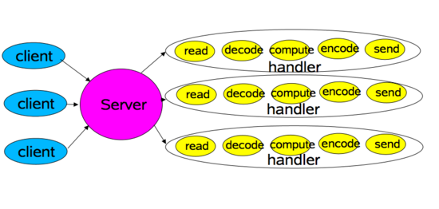
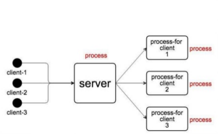
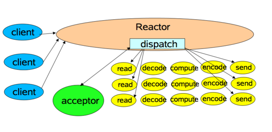
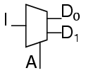

## [Understanding Reactor Pattern Thread-Based and Event-Driven](https://dzone.com/articles/understanding-reactor-pattern-thread-based-and-eve)

处理web请求通常有两种架构：基于线程的架构和事件驱动架构。

### 基于线程的架构

多线程服务器最直觉的实现方法是每个连接一个线程，这种方法对于需要兼容非线程安全的库的网站。

通常这种架构中还会通过多进程模块实现请求隔离，这样单个请求如果发生了问题，不会影响到其他请求。但是多进程会比较重，特别是在上下文切换和内存开销方面，因此，尽管多线程的程序容易发生问题并且难以调试，但是“每个连接一个线程”的方法还是比“每个连接一个进程”拥有更好的可扩展性。

为了调整出最佳性能的线程数量，并且避免线程创建和销毁的开销，通常的实践中会通过分发线程、有限长度的阻塞队列以及线程池实现。分发线程阻塞在套接字上，新的连接到达放入阻塞队列。队列长度有限包含两个含义：首先，如果阻塞队列中的连接数超限，新的连接将会被丢弃；其次，对于进入阻塞队列中的请求，它被处理的延时是确定并且可估计的（译者注：最大延时=队列长度×平均响应时间÷线程数）。线程池中的空闲线程会轮询队列，从中读取新的请求，处理并返回结果。

### 事件驱动架构

事件驱动方法可以把线程和连接解耦，线程只用于执行事件注册的回调函数。事件驱动架构由事件生产者和事件消费者组成，前者是事件的来源，它只负责监听哪些事件发生；后者是直接处理事件或者事件发生时，响应事件的实体。
>The creator, which is the source of the event, only knows that the event has occurred. Consumers are entities that need to know the event has occurred.

#### 反应器模式

反应器模式是事件驱动架构的一种具体实现方法，简而言之，**它就是一个单线程的事件循环，阻塞监听资源的就绪，并将就绪的事件分发给对应的回调函数**。使用事件驱动模式以后，就不需要阻塞等待IO就绪，只要注册事件的回调函数，当事件就绪时调用，例如：新的连接到达、数据可读、数据可写等。在多核环境中，回调函数可以通过线程池实现。

**反应器模式实现了应用层的代码和可复用的事件驱动架构实现之间的解耦。**

>In simple terms, it uses a single threaded event loop blocking on resource-emitting events and dispatches them to corresponding handlers and callbacks. ... There is no need to block on I/O, as long as handlers and callbacks for events are registered to take care of them. Events refer to instances like a new incoming connection, ready for read, ready for write, etc. Those handlers/callbacks may utilize a thread pool in multi-core environments.

反应器模式中有两个重要的组成部分：反应器和回调函数。反应器监听IO事件，把就绪的事件分发给相应的回调函数，后者非阻塞的执行操作。

* 反应器：在独立的线程中执行，它的工作是把就绪的IO事件分发给相应的回调函数。它就像一个电话接线员，把客户的电话转接到相应的联系人。
* 回调函数（译者注：原文是handler）：执行IO事件就绪后的实际工作，它就好比客户想要对话的实际联系人。

反应器模式的目的是允许事件驱动的应用程序实现多路复用，来自不同客户端的请求可以被分发到一个应用上。反应器会持续监听事件，当事件就绪时，反应器会通知回调函数立即处理这个事件。

反应器模式可以实现同步的多路复用，同步是指按照事件到达的顺序分发处理。反应器 接收来自不同的客户端的消息、请求和连接，尽管客户端是并发的，但是反应器可以按照事件到达的顺序触发回调函数。因此，反应器模式中不需要为每个事件都创建一个线程，这个问题的实质和著名的[C10K问题](http://www.kegel.com/c10k.html)是相同的，换言之反应器模式是这个问题的一个解决思路。

总结：在需要并发处理多于10k的客户端的服务器场景下，使用Tomcat、Glassfish、JBoss、HttpClient等框架是不能实现线程的可伸缩的（译者注：这里是指每个连接一个线程，不能无限制的增加线程来应对请求量的增长）。相反，使用反应器模式的服务器，只需要一个线程同步处理并发的请求。
>In Summary: Servers have to handle more than 10,000 concurrent clients, and threads cannot scale the connections using Tomcat, Glassfish, JBoss, or HttpClient. So, the application using the reactor only needs to use a thread to handle simultaneous events.

多路选择器是一种电路，它有一个输入和多个输出，通常的使用场景是需要把一个信号传递给多个电路设备。多路选择器和译码器有些类似，二者的区别是多路选择器用于传递信号，而译码器用于从多个电路设备选择一个（译者注：74138是译码器，输入是地址信号，输出多路中有一路是有效的，其他都是无效的；74151是多路选择器，输入除了地址信号以外还有需要传输的信号，选中的一路输出和输入相同，其他输出是高阻）。

反应器允许多个事件通过一个线程高效率的处理，除此之外，反应器还需要对事件的回调函数进行管理和组织，事件就绪时调用回调函数，反应器需要把请求转发给到空闲的handler并把它标记为正在处理请求。

事件循环：

1. 监听就绪的事件，
2. 顺序执行所有就绪事件的回调函数，直到回调函数执行完成或者阻塞。如果回调函数执行完成，将事件的就绪状态删除，从而可以继续监听这个事件。
3. 返回步骤1
>1. Find all handlers that are active and unlocked or delegates this for a dispatcher implementation.
>
>2. Execute each of these handlers sequentially until complete, or a point is reached where they are blocked. Completed Handlers are deactivated, allowing the event cycle to continue.
>
>3. Repeats from Step One (1)

反应器模式在实践中广泛应用，例如：Node.js、Vert.x、Reactive Extensions、Jetty、Ngnix等，所以如果想了解这些框架的内部的工作原理，需要对反应器模式进行一些学习。
>So if you like the identify pattern and want to know how things work behind the scenes
