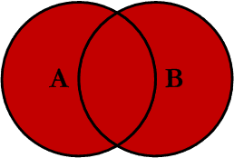
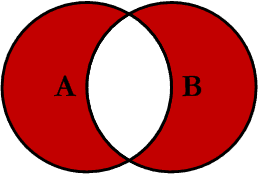

## [Visual Representation of SQL Joins](https://www.codeproject.com/articles/33052/visual-representation-of-sql-joins?utm_source=wanqu.co&utm_campaign=wanqu+daily&utm_medium=social)

### 简介
这篇小文章以可视化的方式来解释SQL的JOIN。

### 背景
我习惯用可视化的方式分析问题，因为图片可以展示出更有意义的东西。我在互联网上找不到一个能够满足我喜好的SQL JOIN的图像表示，有些图很好，但是不完整（有些JOIN漏掉了），另一些则很糟糕。所以我想自己画一下关于SQL JOIN的图并配一篇文章。

### 用代码说话
这篇文章我会讨论从两个关系表查询结果的7种不同情况，这里我排除了cross join和self referencing join。

1. INNER JOIN
2. LEFT JOIN
3. RIGHT JOIN
4. OUTER JOIN
5. LEFT JOIN EXCLUDING INNER JOIN
6. RIGHT JOIN EXCLUDING INNER JOIN
7. OUTER JOIN EXCLUDING INNER JOIN

为了方便起见，我会把低5、6、7三种情况分别简称为LEFT EXCLUDING JOIN、RIGHT EXCLUDING JOIN和OUTER EXCLUDING JOIN。事实上有些人可能认为这三种情况并不是对两张表做JOIN操作，但是为了简便起见，我仍然把让它作为JOIN的原因是你可以在这些查询中使用JOIN（通过WHERE字句排除掉一些结果）。
>but for simplicity, I will still refer to these as Joins because you use a SQL Join in each of these queries (but exclude some records with a WHERE clause).

#### Inner JOIN


这是最简单、最常见和熟知的JOIN。这个查询返回左侧表a中和右侧表b中有匹配的记录。SQL语句如下：
```SQL
SELECT <select_list> 
FROM Table_A A
INNER JOIN Table_B B
ON A.Key = B.Key
```

#### Left JOIN


这个查询返回左侧表a中的所有记录，不论这条记录在右侧表b中是否有匹配的，当然表a和表b有匹配的记录也会返回。SQL语句如下：
```SQL
SELECT <select_list>
FROM Table_A A
LEFT JOIN Table_B B
ON A.Key = B.Key
```

#### Right JOIN


这个查询返回右侧表b中的所有记录，不论这条记录在左侧表a中是否有匹配的，当然表a和表b有匹配的记录也会返回。SQL语句如下：
```SQL
SELECT <select_list>
FROM Table_A A
RIGHT JOIN Table_B B
ON A.Key = B.Key
```

#### Outer JOIN


这种JOIN操作通常被称为FULL OUTER JOIN或者FULL JOIN，查询返回两张表中的所有记录，当然表a和表b有匹配的记录也会返回，SQL语句如下：
```SQL
SELECT <select_list>
FROM Table_A A
FULL OUTER JOIN Table_B B
ON A.Key = B.Key
```

#### Left Excluding JOIN


这个查询返回左侧表a中的记录，这些记录在右侧表b中没有匹配的记录，SQL语句如下：
```SQL
SELECT <select_list>
FROM Table_A A
LEFT JOIN Table_B B
ON A.Key = B.Key
WHERE B.Key IS NULL
```

#### Right Excluding JOIN


这个查询返回右侧表b中的记录，这些记录在左侧表a中没有匹配的记录，SQL语句如下：
```SQL
SELECT <select_list>
FROM Table_A A
RIGHT JOIN Table_B B
ON A.Key = B.Key
WHERE A.Key IS NULL
```

#### Outer Excluding JOIN


这个查询返回左侧表a和右侧表b中的记录，这些记录在另一侧的表中都没有匹配的记录，除了前面几种，这种JOIN我也有需要，并且经常使用。SQL语句如下：
```SQL
SELECT <select_list>
FROM Table_A A
FULL OUTER JOIN Table_B B
ON A.Key = B.Key
WHERE A.Key IS NULL OR B.Key IS NULL
```

>I have yet to have a need for using this type of Join, but all of the others, 

#### 例子
假设有下面两张表Table_A和Table_B，表中的数据如下：
```
TABLE_A
  PK Value
---- ----------
   1 FOX
   2 COP
   3 TAXI
   6 WASHINGTON
   7 DELL
   5 ARIZONA
   4 LINCOLN
  10 LUCENT

TABLE_B
  PK Value
---- ----------
   1 TROT
   2 CAR
   3 CAB
   6 MONUMENT
   7 PC
   8 MICROSOFT
   9 APPLE
  11 SCOTCH
```

7种JOIN操作的结果如下：
```
-- INNER JOIN
SELECT A.PK AS A_PK, A.Value AS A_Value,
       B.Value AS B_Value, B.PK AS B_PK
FROM Table_A A
INNER JOIN Table_B B
ON A.PK = B.PK

A_PK A_Value    B_Value    B_PK
---- ---------- ---------- ----
   1 FOX        TROT          1
   2 COP        CAR           2
   3 TAXI       CAB           3
   6 WASHINGTON MONUMENT      6
   7 DELL       PC            7

(5 row(s) affected)

-- LEFT JOIN
SELECT A.PK AS A_PK, A.Value AS A_Value,
B.Value AS B_Value, B.PK AS B_PK
FROM Table_A A
LEFT JOIN Table_B B
ON A.PK = B.PK

A_PK A_Value    B_Value    B_PK
---- ---------- ---------- ----
   1 FOX        TROT          1
   2 COP        CAR           2
   3 TAXI       CAB           3
   4 LINCOLN    NULL       NULL
   5 ARIZONA    NULL       NULL
   6 WASHINGTON MONUMENT      6
   7 DELL       PC            7
  10 LUCENT     NULL       NULL

(8 row(s) affected)

-- RIGHT JOIN
SELECT A.PK AS A_PK, A.Value AS A_Value,
B.Value AS B_Value, B.PK AS B_PK
FROM Table_A A
RIGHT JOIN Table_B B
ON A.PK = B.PK

A_PK A_Value    B_Value    B_PK
---- ---------- ---------- ----
   1 FOX        TROT          1
   2 COP        CAR           2
   3 TAXI       CAB           3
   6 WASHINGTON MONUMENT      6
   7 DELL       PC            7
NULL NULL       MICROSOFT     8
NULL NULL       APPLE         9
NULL NULL       SCOTCH       11

(8 row(s) affected)

-- OUTER JOIN
SELECT A.PK AS A_PK, A.Value AS A_Value,
B.Value AS B_Value, B.PK AS B_PK
FROM Table_A A
FULL OUTER JOIN Table_B B
ON A.PK = B.PK

A_PK A_Value    B_Value    B_PK
---- ---------- ---------- ----
   1 FOX        TROT          1
   2 COP        CAR           2
   3 TAXI       CAB           3
   6 WASHINGTON MONUMENT      6
   7 DELL       PC            7
NULL NULL       MICROSOFT     8
NULL NULL       APPLE         9
NULL NULL       SCOTCH       11
   5 ARIZONA    NULL       NULL
   4 LINCOLN    NULL       NULL
  10 LUCENT     NULL       NULL

(11 row(s) affected)

-- LEFT EXCLUDING JOIN
SELECT A.PK AS A_PK, A.Value AS A_Value,
B.Value AS B_Value, B.PK AS B_PK
FROM Table_A A
LEFT JOIN Table_B B
ON A.PK = B.PK
WHERE B.PK IS NULL

A_PK A_Value    B_Value    B_PK
---- ---------- ---------- ----
   4 LINCOLN    NULL       NULL
   5 ARIZONA    NULL       NULL
  10 LUCENT     NULL       NULL
(3 row(s) affected)

-- RIGHT EXCLUDING JOIN
SELECT A.PK AS A_PK, A.Value AS A_Value,
B.Value AS B_Value, B.PK AS B_PK
FROM Table_A A
RIGHT JOIN Table_B B
ON A.PK = B.PK
WHERE A.PK IS NULL

A_PK A_Value    B_Value    B_PK
---- ---------- ---------- ----
NULL NULL       MICROSOFT     8
NULL NULL       APPLE         9
NULL NULL       SCOTCH       11

(3 row(s) affected)

-- OUTER EXCLUDING JOIN
SELECT A.PK AS A_PK, A.Value AS A_Value,
B.Value AS B_Value, B.PK AS B_PK
FROM Table_A A
FULL OUTER JOIN Table_B B
ON A.PK = B.PK
WHERE A.PK IS NULL
OR B.PK IS NULL

A_PK A_Value    B_Value    B_PK
---- ---------- ---------- ----
NULL NULL       MICROSOFT     8
NULL NULL       APPLE         9
NULL NULL       SCOTCH       11
   5 ARIZONA    NULL       NULL
   4 LINCOLN    NULL       NULL
  10 LUCENT     NULL       NULL

(6 row(s) affected)
```

注意在OUTER JOIN中，INNER JOIN的结果在前面，然后是RIGHT JOIN，最后是LEFT JOIN（至少Microsoft SQL Server是这么实现的，并且没有使用ORDER BY子句）。更多的信息可以参考[维基百科](http://en.wikipedia.org/wiki/Sql_join)（但是维基百科上的词条没有图片）。我还制作了一个速查表，如果你需要可以打出来，右键点击图片选择“另存为”可以下载完整大小的图片。


### 历史
* 初次发布，02/03/2009
* 1.0版本，修复速查表和一些拼写错误，02/04/2009

>Fixed cheat sheet and minor typos.

### 许可证
这篇文章，连同相关的代码和文件，受[The Code Project Open License](http://www.codeproject.com/info/cpol10.aspx)许可证的保护。
