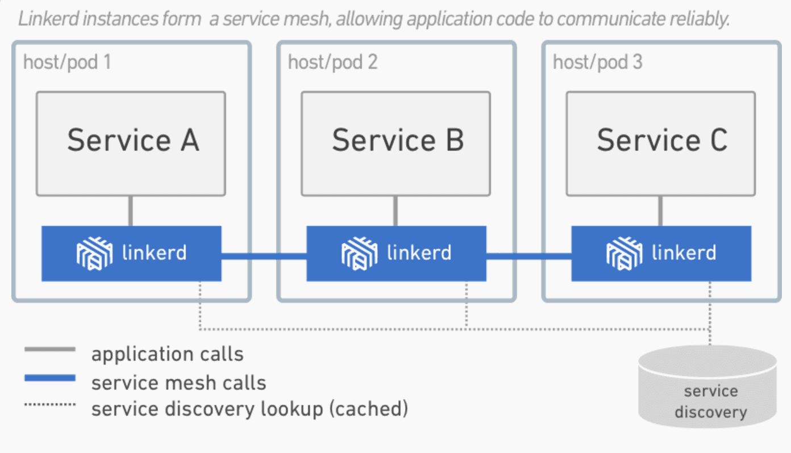

## [What's a Service Mesh? And Why Do I Need One?](https://buoyant.io/2017/04/25/whats-a-service-mesh-and-why-do-i-need-one/)

### TLDR
1. why
    * for the reliable delivery of requests through the complex topology of services that comprise a modern, cloud native application
    * assume TCP is unreliable, the service mesh must therefore alse be capable of handling network failures
    * move service communication out of the realm of the invisible, implied infrastructure, and into the role of a first-class member of the ecosystem—where it can be monitored, managed and controlled.
    * safeguard against system-wide catastrophic failures by shedding load and failing fast when the underlying systems approach their limits.
2. what
    * The service mesh is ultimately not an introduction of new functionality, but rather shift in where functionality is located.
    * an array of lightweight network proxies that are deployed alongside application code, without the application needing to be aware
    * just as the TCP stack abstracts the mechanics of reliably delivering bytes between network endpoints, the service mesh abstracts the mechanics of reliably delivering requests between services.
3. how
    * dynamically configurable service router: production version, testing version
    * service naming: service -> instance list
    * latency-aware instance selector
    * retry, mark consistntly error&periodically detect, fail fast when deadline
    * upload trace&metric

### 翻译
在过去的一年中，Service Mesh已经成为云原生技术栈里的一个关键组件。很多拥有高负载业务流量的公司都在他们的生产应用里加入了Service Mesh，[如PayPal、Lyft、Ticketmaster和Credit Karma等](http://info.buoyant.io/press/2017/03/07/linkerd_1.0_release)。今年一月份，Service Mesh组件Linkerd成为CNCF（Cloud Native Computing Foundation）的[官方项目](https://techcrunch.com/2017/01/23/cloud-native-computing-foundation-adds-linkerd-as-its-fifth-hosted-project/)。不过话说回来，Service Mesh到底是什么？为什么它突然间变得如此重要（注：原文是relevant）？

在这篇文章里，我将给出Service Mesh的定义，并追溯过去十年间Service Mesh在应用架构中的演变过程。我会解释Service Mesh与API网关、边缘代理（Edge Proxy）和企业服务总线（enterprise service bus）之间的区别。最后，我会描述Service Mesh将何去何从以及我们可以作何期待。

#### 什么是Service Mesh？
Service Mesh是一个专用于处理服务间通信的基础设施层。当前的云原生应用都有着复杂的服务拓扑，Service Mesh保证请求可以在这些拓扑中可靠地传递。在实际应用当中，Service Mesh通常是由一系列轻量级的网络代理组成的，它们与应用程序部署在一起，但应用程序不需要知道它们的存在（实际上这个想法会有一定的变化，后面我们会具体介绍）。

Service Mesh成为一个独立的基础设施层的概念跟云原生应用的崛起息息相关的。在云原生模型里，一个应用可以由数百个服务组成，每个服务可能有数千个实例，而每个实例可能会因为类似k8s的动态调度持续地发生变化。服务间通信不仅异常复杂，而且也是运行时行为中普遍和基础的一部分。管理好服务间通信对于保证端到端的性能和可靠性来说是非常重要的。

### Service Mesh是一种网络模型吗？
Service Mesh实际上就是处于TCP/IP之上的一个抽象层，它假设底层的L3/L4网络能够点对点地传输字节（当然，它也假设L3/L4的网络环境和其他环境一样都是不可靠的，所以Service Mesh必须具备处理网络故障的能力）。

从某种程度上说，Service Mesh有点类似TCP/IP。TCP协议栈对网络端点间可靠传输字节的机制进行了抽象，而Service Mesh则是对服务间可靠传输请求的机制进行了抽象。和TCP类似，Service Mesh不关心消息体是什么，也不关心它们是如何编码的。应用程序的目标是“将某些东西从A传送到B”，而Service Mesh所要做的就是实现这个目标，并处理传送过程中可能出现的任何故障。

与TCP不同的是，Service Mesh有着更高的目标：为应用运行时提供统一的、应用层面的可见性和可控性。为了明确的实现这个目标，Service Mesh将服务间通信从不可见、隐晦的基础设施中分离出来，让它成为整个生态系统的一等公民——它因此可以被监控、托管和控制。

### Service Mesh可以做什么？
在云原生应用中可靠的传输服务请求是一项非常复杂的任务。以[Linkerd](https://linkerd.io/)为例，它使用了一系列强大的技术来管理这种复杂性：回路熔断器、基于延时感知的负载均衡、最终一致的服务发现、重试和超时。这些技术需要组合在一起，它们之间的相互作用在复杂的环境中变得非常微妙。

举个例子，当一个请求流经Linkerd时，会发生如下的一系列事件（原文：a very simplified timeline of events is as follows）：

1. Linkerd根据动态路由规则确定请求是发给哪个服务的，比如是发给生产环境里的服务还是发给演示环境（原文：staging）里的服务？是发给本地数据中心的服务还是发给云端的服务？是发给测试中的新版本服务还是发给已经在生产环境中验证的旧版本服务？这些路由规则可以动态配置，可以应用在全局的流量上，也可以应用在部分流量上。
2. 在确定了请求的目标服务后，Linkerd从服务发现端点获取相应的服务实例，可能有一个或者多个实例。如果服务实例的信息和Linkerd本地的结果不一致，Linkerd需要决定哪个信息来源更值得信任。
3. Linkerd基于一系列因素（比如最近处理请求的延迟情况）选择更有可能快速返回响应的实例。
3. Linkerd向选中的实例发送请求，记录延迟和响应类型。
4. 如果选中的实例发生宕机、没有响应或无法处理请求，Linkerd就把请求发给另一个实例（前提是请求必须是幂等的）。
5. 如果一个实例持续返回错误，Linkerd就会将其从负载均衡池中移除，并在稍后定时重试（这个实例有可能只是临时发生故障）。
6. 如果请求截止时间到达（还没收到响应），Linkerd会主动放弃请求，不会进行额外的重试避免给服务增加压力。
4. Linkerd以度量指标和分布式追踪的方式记录上述各种行为，并发送给中心度量指标系统。

除此之外，Linkerd还能发起和终止TLS、执行协议升级、动态调整流量、在数据中心之间进行失效备援（原文：fail over between datacenters）。

Linkerd的这些特性可以保证局部的弹性和应用层面的弹性。大规模分布式系统不论采用何种架构，都有一个典型的特性：（由于系统规模庞大）局部故障容易累积造成系统层面的灾难。Service Mesh的作用就是在底层系统的负载达到上限之前通过分散流量和快速失效来防止这些故障破坏到整个系统。

### 为什么我们需要Service Mesh？
从根本上说，Service Mesh并非新出现的功能，而是调整了现有功能所在的位置。一直以来，Web应用程序需要自己管理复杂的服务间通信，从过去十多年间应用程序的演化就可以看到Service Mesh的影子。

2000年左右的中型Web应用一般使用了三层模型：应用逻辑层、Web服务逻辑层和存储逻辑层。层与层之间的交互虽然也不算简单，但复杂性是很有限的，毕竟一个请求最多只需要两个跳转。虽然这里不存在“网格”，但层与层之间还是需要通信的逻辑，需要在上层和下层的代码中实现。

随着规模的增长，这种架构就显得力不从心了（原文：it started to break）。像Google、Netflix、Twitter这些面对大规模用户流量的公司，他们实现了一种高效的解决方案，也就是云原生应用的前身：应用层被拆分为多个服务（也叫作微服务），这个时候层就变成了一种拓扑结构。在这样的系统中，迫切需要一个通用的通信层，以一个“富客户端”（原文：fat client）包的形式存在，如Twitter的[Finagle](https://twitter.github.io/finagle/)、Netflix的[Hystrix](https://github.com/Netflix/Hystrix)和Google的Stubby。

在很多方面，像Finagle、Stubby和Hystrix这样的包就是最初的Service Mesh。尽管它们针对特定的基础环境、需要使用特定的编程语言和框架，但是它们是专门用来管理服务间通信的的基础设施的雏形，并且Finagle和Hysterix的开源实现也有在它们原始公司以外的应用案例。

随着快速发展进入现代云原生应用时代，云原生模型在原先的微服务模型中加入了两个额外的元素：容器（比如[Docker](https://docker.com/)，提供了资源隔离和以来管理）和编排（如[Kubernetes](http://kubernetes.io/)，对底层的硬件抽象成同质化的资源池）。

这三个组件让应用程序在云环境中自然而然的具备了伸缩能力和处理局部故障的能力。但随着服务和实例的数量增长，编排层需要无时不刻地调度实例，请求在服务拓扑间穿梭的路线也变得异常复杂，再加上容器化使得可以使用任意语言来开发服务，所以之前那种“富客户端”包的方式就行不通了。

这种复杂性和迫切性共同催生了专用的服务间通信层的出现，这个层既不会与应用程序的代码耦合，又能捕捉底层环境高度动态的特性，它就是Service Mesh。

### Service Mesh的未来
尽管Service Mesh在云原生系统方面的应用已经有了快速的增长，但仍然存在巨大的、令人兴奋的探索空间。Service Mesh的名字服务以及连接管理模型完美满足Serverless计算的需求（如Amazon的[Lambda](https://aws.amazon.com/lambda/)），这让Service Mesh在云原生生态系统中的角色得到了彰显（原文：form a natural extension of its role）。服务识别和访问策略在云原生环境中仍显初级，而Service Mesh毫无疑问将成为这方面不可或缺的基础。最后，就像TCP/IP一样，Service Mesh将在底层基础设施这条道上进一步深挖。就如同Linkerd是从Finagle中发展而来一样（Linkerd就是把Finagle的功能以服务化的方式独立出来），随着更多类似Linkerd的应用层代理服务被显式的添加到云原生技术栈，会持续促进这些应用层代理服务的发展。

>Just as Linkerd evolved from systems like Finagle, the current incarnation of the service as a separate, user-space proxy that must be explicitly added to a cloud native stack will also continue to evolve.

### 结论
Service Mesh是云原生技术栈中一个非常关键的组件。Linkerd项目在启动一年多之后正式成为CNCF的官方项目，并拥有了繁荣的社区和用户。Linkerd的用户横跨初创公司（如Monzo）到大规模的互联网公司（如PayPal、Ticketmaster、Credit Karma），再到拥有数百年历史的老牌公司（如Houghton Mifflin Harcourt）。

### 参考翻译
[什么是服务网格以及为什么我们需要服务网格?](http://www.infoq.com/cn/news/2017/11/WHAT-SERVICE-MESH-WHY-NEED)
[备用原文链接](https://dzone.com/articles/whats-a-service-mesh-and-why-do-i-need-one)