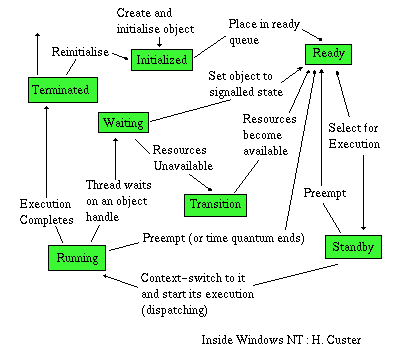

# [调度](http://www.tldp.org/LDP/LG/issue23/flower/schedule.html)

调度器的职责是协调运行的进程，通过管理进程对系统资源的访问使得每个进程能够公平的得到运行机会，同时让CPU的利用率最大化。调度器（任务派发器）必须确保进程根据自己的优先级以及进程组分配到相应的CPU时间，即使对于最低优先级的进程也不会被饿死。

进程等待时可以主动放弃CPU，例如：等待系统资源或者和其他进程同步。另外，调度器也会在进程的CPU时间用完时主动剥夺这个进程的CPU，然后调度器再选择一个最合适的进程继续运行。

调度是内核实现的，首先调度对进程的状态进行了划分：

### Linux
1. 运行中：进程是当前系统中运行的进程，即占有CPU并执行操作。
2. 就绪：进程在运行队列中，等CPU可用就能运行。
3. 等待（可中断）：进程在等待资源或者事件时没有阻塞信号，所以可能被信号中断等待。
4. 等待（不可中断）：进程在等待资源或者事件时禁止了信号，所以不能被中断等待。
5. 停止：通常是在调试时通过向进程发送SIGSTOP信号让进程停止运行。
6. 僵尸：进程已经执行完成并准备退出，但是调度器还没检测到进程的这个状态，因此进程的task_struct还存在在内核中。

### Windows NT
1. 运行中：进程是当前CPU上活跃的进程。
2. 待命：只能有一个线程处于待命状态，这个线程已经被调度器选中接下来运行。
3. 就绪：线程等待执行，在下一个调度周期时调度器从这个状态的线程中选出一个进入待命状态。
4. 等待：线程等待同步事件，例如等待I/O或者是被环境子系统挂起。
5. 转换：线程准备执行，但是它需要的资源还没有就绪（例如线程的内核栈被换出内存）。
6. 终止：线程结束了运行，此时由对象管理器决定是否删除线程。If the *executive* has a pointer to the thread it may be reinitialised and reused. 

不同操作系统调度任务是类似的，但是每种操作系统解决问题的方法有所不同：

### Linux
1. task优先级范围是-20~+20，默认优先级是0，最高优先级是-20。只有管理员可以设置低于0的优先级，普通用户可以在正数范围的优先级中调整。调整优先级的命令是renice，Linux内部用task_struct中的时间片计数器（原文：time quantum counter ）jiffies来保存优先级。
2. 子进程继承父进程的优先级。
3. 支持实时进程，实时进程优先级高于非实时进程。
4. 对于已经获得了一些CPU时间的线程，它们的优先级会比同优先级的线程动态降低。

### Windows NT
1. 线程优先级范围是1~31，默认优先级是8，最高优先级是31，0为系统保留使用。只有管理员可以设置超过15的优先级。普通用户可以在1~15之间调整优先级：线程优先级调整由任务管理器实现，首先设置进程组，然后设置组内的相对优先级。（原文：normal users can set a process's priority in the 1 to 15 range in a two step process by first setting the process class and then setting the relative priority within the class.）
2. 新的进程继承创建它的进程的优先级。
3. 优先级为16-31的进程是实时进程，它们在实时进程组中。
4. time-critical和idle修饰符会在线程的动态范围中调整线程的优先级。（原文：time-critical and idle modifiers may move a dynamic thread's priority to the top or bottom of it's dynamic range respectively.）
5. Non real-time threads may be boosted in priority should (e.g.) a blocked thread receive an event if was waiting for. This boost decays over time as the thread receives CPU time.

下图展示了Windows NT调度器使用的状态机，尽管和上面表格中Linux状态机的具体状态不同，但是Windows NT和Linux大体上是类似的（原文：From the above tables it can be seen that although the corresponding state for machine for Linux will be different it will be similar）。除此之外，Linux支持bottom half handlers的内核机制，这里没有介绍。
