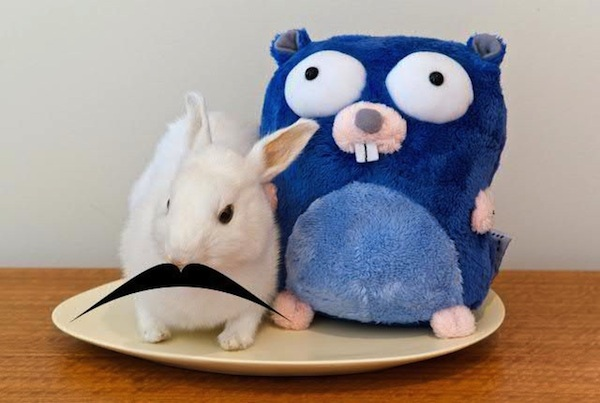

## [A GIF decoder: an-exercise in Go interfaces](https://blog.golang.org/gif-decoder-exercise-in-go-interfaces)

25 May 2011 By Rob Pike

### 简介
2011年5月10日在旧金山召开了Google I/O大会，我们宣布Google App Engine现在支持Go语言。Go语言是App Engine上第一个直接编译成机器码执行的语言。对于CPU密集型任务，例如图片操作，Go语言是一个很好的选择。

我们展示了一个叫做[Moustachio](http://moustach-io.appspot.com/)的程序，它可以很容易像下面这张图片这样向图上添加一个胡子来改进图片：




所有图像处理包括渲染胡子图形的反锯齿，都是通过App Engine上执行的一个Go程序来完成的，源码位于[这里](http://code.google.com/p/appengine-go/source/browse/example/moustachio/)

尽管互联网上的大多数图片都是JPEG格式，至少想要加胡子的那些图片是JPEG，但是图片的格式还有很多种，所以Moustachio程序很有必要接受几种上传的图片格式。Go图像处理库已经支持了JPEG和PNG的解码，但是更珍贵的GIF格式在Go的图像库里面还没有，所以我们打算实现一个GIF解码器，并在大会上演示。GIF解码器由几个部分组成，这些部分展示了Go的接口可以让复杂的问题简单化。这篇博客的剩余部分描述了解码器的组成部分。

>The rest of this blog post describes a couple of instances.

### GIF格式


首先让我们快速的浏览一下GIF格式。GIF格式的图片是带调色板的，每个像素值都是图片文件中保存的颜色映射中的索引。GIF格式可以追溯到每个像素不到8bit的时代，颜色映射的作用是把有限的颜色值集合转换成点亮屏幕所需的RGB三元组。JPEG没有颜色映射，因为编码算法可以表示每个独立的颜色信号。

GIF图片每个像素取值的范围为1-8bit，包括1bit和8bit，其中8bit每个像素是最常见的。

简化一下，GIF格式的文件由文件头和像素数据组成：
* 文件头：定义了像素深度（译者注：每个像素几个bit）、图片维度（译者注：宽高）、颜色映射（如果每个像素是8bit，那么颜色映射就是256个RGB三元组）。
* 像素数据：以一维的比特流存储，用LZW算法压缩（LZW算法对于计算机生成的图片压缩效果很好，但是对于真实的照片效果就很差了）。压缩后的bit流按照一定的长度分块，每个块的长度用1字节保存，每个块最多255字节。

>The compressed data is then broken into length-delimited blocks with a one-byte count (0-255) followed by that many bytes:


### 解码像素数据
我们用`compress/lzw`包中的LZW解码器解码GIF的像素数据。[如文档所说](http://golang.org/pkg/compress/lzw/#NewReader)，我们用`NewReader`函数返回一个对象，从`r`中读取数据并解码。

`order`参数指定了位压缩的顺序，`litWidth`参数指定一个word有多少bit，word对于GIF文件表示像素深度，通常是8。

我们不能把输入文件作为`NewReader`的第一个参数，因为解码器需要字节流，但是GIF的像素数据是按照一定长度分块存储的。为了解决这个问题，我们把`io.Reader`包装一下，把块流转换为字节流。换言之，我们实现一个新的类型`blockReader`，把从块转换为字节的代码放在`blockReader`的`Read`方法中，也就是让`blockReader`也实现`io.Reader`。

下面是`blockReader`的数据结构：
```golang
type blockReader struct {
   r     reader    // Input source; implements io.Reader and io.ByteReader.
   slice []byte    // Buffer of unread data.
   tmp   [256]byte // Storage for slice.
}
```

`r`是图片数据的源，可能是一个文件或者HTTP连接。`slice`和`tmp`字段用于解析块。下面是完整的`Read`方法，它是一个Go语言的slice和array使用的很好的例子：
```golang
1  func (b *blockReader) Read(p []byte) (int, os.Error) {
2      if len(p) == 0 {
3          return 0, nil
4      }
5      if len(b.slice) == 0 {
6          blockLen, err := b.r.ReadByte()
7          if err != nil {
8              return 0, err
9          }
10          if blockLen == 0 {
11              return 0, os.EOF
12          }
13          b.slice = b.tmp[0:blockLen]
14          if _, err = io.ReadFull(b.r, b.slice); err != nil {
15              return 0, err
16          }
17      }
18      n := copy(p, b.slice)
19      b.slice = b.slice[n:]
20      return n, nil
21  }
```

L2-4：“通情达理”的参数检查，如果输入的slice中没有空间存储解码后的数据，返回0。这个情况应该不会出现，但是检查一下还是安全。

L5：通过`b.slice`的长度判断是否上一个块还有没有读取完成的数据。如果上一个块的数据都读取到参数`p`的slice中，那么`b.slice`的长度应该为0，我们需要从数据源`r`中读取下一个块。

L6：GIF的像素数据，每个块的第一个字节是块长度。

L10-12：如果块长度为0，GIF定义这个块为终止块，然后我们返回EOF。

L13-16：现在我们通过`blockLen`就知道后面的块有多少字节，所以我们把`b.slice`指向`b.tmp`的前`blockLen`字节，通过`io.ReadFull`方法读取最多`b.slice`长度个字节。如果没读到这么多字节，函数会返回错误，通常不会发生。否则，`b.slice`中就保存了`blockLen`字节，准备返回给参数`p`的slice。

L18-19：从`b.slice`中拷贝数据到用户的buffer中，`blockReader`实现的是`Read`方法，它的语意是返回数据不多于用户的buffer。这很容易实现，我们把`b.slice`的数据拷贝到用户的buffer`p`中，`copy`返回值是真正拷贝到`p`中的字节数。然后我们调整`b.slice`的长度，丢弃前`n`个字节，准备下一次调用。

把一个slice和array关联起来是Go语言中很美妙的技术。在这个例子中，`blockReader`的`Read`方法永远也不会进行任何的内存分配（译者注：`blockReader`按照块为单位转换为字节流，一个GIF块的长度不超过256字节，块之间的复用了`b.tmp`），我们也不需要计算字节数（`b.slice`的长度），内置函数`copy`保证了拷贝的字节数不会超过用户buffer的长度。（更多关于slice的内容，请参考这篇[Go Blog](http://blog.golang.org/2011/01/go-slices-usage-and-internals.html)）

实现了`blockReader`类型以后，我们可以把块流的图片数据转换为字节流，只需要在图片数据源的reader（例如一个文件）上包装一个`blockReader`即可，然后调用`Read`方法：
```golang
deblockingReader := &blockReader{r: imageFile}
```

### 连接片段
实现了`blockReader`以后，并且LZW解码器可以用库里面的，我们现在拥有了解码图片数据流需要的全部组成部分，我们可以以迅雷不及掩耳的把这些部分组合起来，上代码：
```golang
lzwr := lzw.NewReader(&blockReader{r: d.r}, lzw.LSB, int(litWidth))
if _, err = io.ReadFull(lzwr, m.Pix); err != nil {
   break
}
```

所有的代码就这些。

第一行创建了一个`blockReader`并把它作为`lzw.NewReader`的第一个参数，`d.r`是一个`io.Reader`保存了图片数据源，`lzw.LSB`定义了LZW解码器的字节顺序，`litWidth`是像素深度。

`NewReader`创建了解码器，第二行调用了`io.ReadFull`方法解码图像数据并保存在`m.Pix`中。当`ReadFull`返回时，图片的数据就完成了解码并保存在变量`m`中用于显示。

上面的代码一次就能正常运行，真的。

像在调用`NewReader`时直接定义`blockReader`，我们可以把`NewReader`作为`ReadFull`的参数，从而避免临时变量`lzwr`。但是这样会让一行代码包含太多的内容。

### 结论
像GIF解码器的例子这样，Go语言的接口让通过组装模块转换数据变得更容易。在这个例子中，我们通过`io.Reader`接口链式调用块解析器和LZW解码器，实现了GIF解码，这一点很像unix的管道。另外我们让块解析器隐式实现了`Reader`接口，不需要声明任何额外的数据或者接口签名就可以适配到GIF解码处理的流水线中。这个解析器如果用大多数语言都很难这么紧凑、整洁和安全的实现，但是Go的接口机制再加上一些惯例用法使得这个解析器用Go实现很自然。

>Also, we wrote the deblocker as an (implicit) implementation of a Reader interface, which then required no extra declaration or boilerplate to fit it into the processing pipeline.

下面是Moustachio程序生成的另一张图片，这次是一个GIF。


GIF格式定义在[这里](http://www.w3.org/Graphics/GIF/spec-gif89a.txt)


